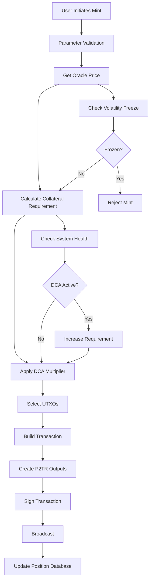
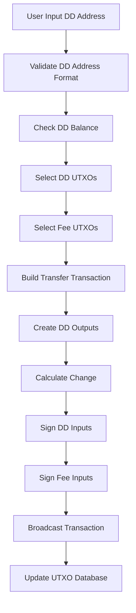
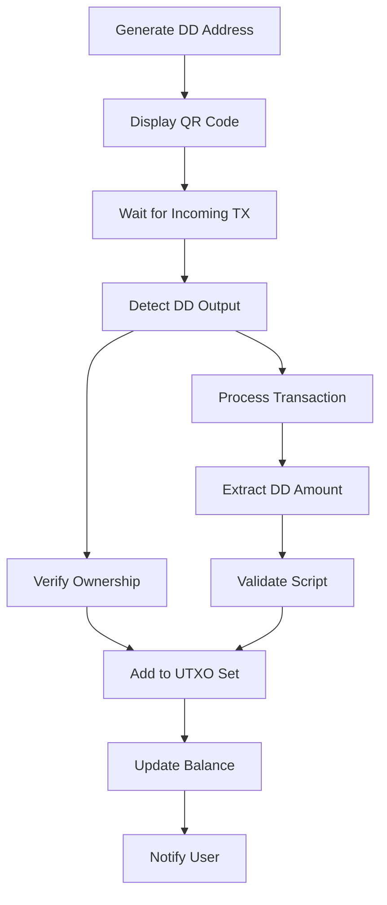

# DigiDollar Implementation Architecture
**DigiByte v8.26 - Current Implementation Status**
*Updated: 2026-04-14*
*Implementation Status: ~85% Complete*
*Document Version: 6.6 - Validated against codebase*
*Validation Status: ✅ Validated Against Codebase (2026-04-14)*

## Executive Summary

### What is DigiDollar?

DigiDollar is the world's first truly decentralized stablecoin built natively on a UTXO blockchain (DigiByte). Unlike traditional stablecoins controlled by companies or banks, DigiDollar operates without any central authority. Every DigiDollar is backed by locked DigiByte (DGB) coins held in secure, time-locked digital vaults that users control with their own private keys.

**Think of it like this**: Imagine you have $1,000 worth of gold that you want to convert to cash for spending, but you don't want to sell the gold and lose future gains. DigiDollar lets you lock that gold in a secure vault and get $500 in spending money today. The gold never leaves your vault - you just can't access it until the time-lock expires. When it does, you can burn the $500 DigiDollar and get your gold back, keeping all the appreciation.

### Current Implementation Status

**85% Complete** - This is not vaporware! The DigiDollar system has approximately 44,000 lines of source code and 99,000 lines of tests (~143,000 total) with sophisticated features already working:

✅ **What's Working Right Now:**
- **Complete Address System**: DD/TD/RD addresses work perfectly
- **Minting Process**: Users can create DigiDollars by locking DGB (fully refactored)
- **Sending/Receiving**: Transfer DigiDollars between users (fully operational)
- **Network-Wide Tracking**: Blockchain UTXO scanning shows identical stats to all nodes
- **User Interface**: Complete wallet with 7 functional tabs (Overview, Receive, Send, Mint, Redeem, Positions, Transactions)
- **Protection Systems**: DCA, ERR, and Volatility structure complete (70%) - depends on stub functions
- **Comprehensive Testing**: 66 DigiDollar unit test files + 16 Oracle unit test files + 19 MuSig2 unit test files + 1 redteam audit file + 51 functional test files = 153 total test files (note: wallet/Qt/redteam tests within the 66 DD files are not double-counted)

🔄 **What's In Progress:**
- **System Health Functions**: `GetTotalSystemCollateral()` and `GetTotalDDSupply()` now use cached metrics from UTXO scanning
- **Oracle Price Feeds**: 6 active exchange API fetchers, Phase Two/Phase 3 MuSig2 infrastructure ready (9-of-17 mainnet — RC30)
- **Redemption System**: Basic version working, ERR redemptions with increased DD burn implemented
- **Final Polish**: Minor notification improvements

✅ **Recently Completed (Dec 2025):**
- **ERR Semantics Corrected**: ERR now correctly increases DD burn requirement (not reduces collateral)
- **DCA/ERR Integration**: Both systems now use cached system metrics from health monitor
- **Qt Timer Optimization**: Reduced from 30s to 5s for better cross-wallet sync
- **Oracle Phase Two Preparation**: 10 testnet oracle keys defined, validation infrastructure ready

This document explains exactly how everything works, where the code lives, and what each component does - written for both technical developers and everyday users to understand.

---

## 1. How DigiDollar Works - The Big Picture

### 1.1 The Four Main Things You Can Do

**Think of DigiDollar like a high-tech bank vault system where you're always in control:**

1. **🏦 MINT (Create DigiDollars)**: Lock your DGB in a digital vault, get DigiDollars to spend
2. **💸 SEND (Transfer DigiDollars)**: Send DigiDollars to anyone with a DD address
3. **📨 RECEIVE (Get DigiDollars)**: Generate DD addresses to receive DigiDollars from others
4. **🔓 REDEEM (Get Your DGB Back)**: Burn DigiDollars to unlock your original DGB

### 1.2 Current Implementation Status - What Actually Works

| What Users Can Do | How Complete | What This Means |
|------------------|--------------|-----------------|
| **🏦 Create DigiDollars (Minting)** | ✅ 95% Working | Fully refactored with DCA integration and system health checks |
| **💸 Send DigiDollars** | ✅ 98% Working | Sending money works perfectly - fully tested |
| **📨 Receive DigiDollars** | ✅ 90% Working | Receiving works, minor notification enhancements pending |
| **🔓 Get DGB Back (Redemption)** | 🔄 75% Working | Basic redemption works, advanced features being polished |
| **🌐 Network Tracking** | ✅ 100% Working | UTXO scanning provides network-wide visibility - VERIFIED |
| **📱 User Interface** | ✅ 100% Working | Complete wallet app with 7 tabs (Overview, Receive, Send, Mint, Redeem, Positions, Transactions) |
| **🛡️ Safety Systems** | 🔄 70% Working | DCA, ERR, Volatility structure complete - needs system health functions |
| **💰 Price Feeds** | ✅ 85% Working | 6 active exchange API fetchers via libcurl, mock fallback for regtest |
| **🗄️ Data Storage** | ✅ 100% Working | Your DigiDollars and vaults save properly (tested today) |

### 1.3 Where the Code Lives

**For Technical Users & Developers:**
The DigiDollar system is built into DigiByte Core with code organized in these main folders:

- **`/src/digidollar/`** - Core DigiDollar logic (5 .cpp + 5 .h files)
- **`/src/oracle/`** - Price feed system (10 .cpp + 12 .h files, includes MuSig2 signing)
- **`/src/qt/`** - User interface (10 widget .cpp + 10 .h files)
- **`/src/wallet/`** - Wallet integration (digidollarwallet.cpp + .h)
- **`/src/consensus/`** - Network rules (DCA, ERR, volatility systems)
- **`/src/rpc/`** - RPC commands (digidollar.cpp + digidollar_transactions.cpp)
- **`/test/functional/`** - Automated tests (51 functional test files)
- **`/src/test/`** - Unit tests (66 DigiDollar + 16 Oracle + 19 MuSig2 + 1 redteam = 102 total unit test files; the 66 DD files already include wallet/Qt/1 redteam tests)

### 1.4 Development Phases - What's Been Built

**Phase 1 (Foundation): ✅ Complete**
- Basic building blocks: How to store DigiDollars, create addresses, define transaction types
- **Technical**: Core data structures, P2TR scripts, DD/TD/RD address format, transaction versioning

**Phase 2 (Core Operations): ✅ Mostly Complete**
- The main things users do: Mint, send, receive DigiDollars
- **Technical**: Minting process (refactored Oct 2024), transfer system operational, receiving detection working

**Phase 3 (Polish & Integration): 🔄 In Progress**
- Connecting everything together and making it production-ready
- **Technical**: Oracle price feeds (framework complete), GUI notifications, database optimizations

---

## 2. DigiDollar Process Flowchart

```
┌─────────────────┐
│  USER ACTION    │
└────────┬────────┘
         │
         ▼
┌─────────────────────────────────────────────────────────────┐
│                    DETERMINE ACTION TYPE                     │
├─────────────────────────────────────────────────────────────┤
│  • Mint: Create new DigiDollars                             │
│  • Transfer: Send DigiDollars to DD address                 │
│  • Redeem: Burn DigiDollars, recover DGB                    │
│  • Receive: Generate DD addresses, detect incoming DD       │
└─────────────────────────────────────────────────────────────┘
         │
    ┌────┴────┬──────────┬───────────┐
    ▼         ▼          ▼           ▼
┌────────┐ ┌──────────┐ ┌─────────┐ ┌─────────┐
│  MINT  │ │ TRANSFER │ │ RECEIVE │ │ REDEEM  │
└────┬───┘ └────┬─────┘ └────┬────┘ └────┬────┘
     │          │            │            │
     ▼          ▼            ▼            ▼
┌─────────────────────────────────────────────┐
│            MINT PROCESS                      │
├─────────────────────────────────────────────┤
│ 1. Select lock period (30d to 10y)          │
│ 2. Get current oracle price                 │
│ 3. Check system health (DCA status)         │
│ 4. Calculate required collateral:           │
│    Base Ratio × DCA Multiplier × DD Amount  │
│ 5. Lock DGB in P2TR output with MAST        │
│ 6. Create DigiDollar P2TR output            │
│ 7. Record collateral position in database   │
│ 8. Sign transaction with Schnorr + ECDSA    │
│ 9. Broadcast to network via wallet chain    │
└──────────────────────────────────────────────┘
                    │
                    ▼
┌─────────────────────────────────────────────┐
│            TRANSFER PROCESS                  │
├─────────────────────────────────────────────┤
│ 1. Validate DD address (DD/TD/RD prefix)    │
│ 2. Select DD UTXOs for input (greedy)       │
│ 3. Select DGB UTXOs for fees               │
│ 4. Create DD outputs to recipient           │
│ 5. Add DD change output if needed           │
│ 6. Sign DD inputs with Schnorr (P2TR)       │
│ 7. Sign fee inputs with ECDSA               │
│ 8. Broadcast via wallet chain interface     │
│ 9. Update UTXO database (remove spent)      │
│ 10. Add new UTXOs (change, self-transfers)  │
└──────────────────────────────────────────────┘
                    │
                    ▼
┌─────────────────────────────────────────────┐
│            RECEIVE PROCESS                   │
├─────────────────────────────────────────────┤
│ 1. Generate new P2TR DD address             │
│ 2. Encode with DD/TD/RD prefix               │
│ 3. Create QR code for payment request       │
│ 4. Add to address book with label           │
│ 5. Monitor incoming transactions            │
│ 6. Detect DD outputs via SyncTransaction    │
│ 7. Verify ownership with IsMine()           │
│ 8. Extract DD amount from script            │
│ 9. Add to UTXO tracking database            │
│ 10. Update balance and notify (pending)     │
└──────────────────────────────────────────────┘
                    │
                    ▼
┌─────────────────────────────────────────────┐
│            REDEMPTION PROCESS                │
├─────────────────────────────────────────────┤
│ 1. Check redemption path (2 paths only):    │
│    • Normal: Timelock expired, health ≥100% │
│      → Burn original DD, get 100% collateral│
│    • ERR: Timelock expired, health < 100%   │
│      → Burn MORE DD (up to 125%), get 100%  │
│        collateral back (FULL amount)        │
│ 2. Select DD UTXOs to burn:                 │
│    • Normal: Burn original minted amount    │
│    • ERR: Burn originalDD / ERRratio        │
│ 3. Create redemption transaction with:      │
│    • Input 0: Collateral vault (P2TR)       │
│    • Input 1+: DD tokens to burn            │
│    • Input N: DGB for fees                  │
│ 4. Sign inputs:                             │
│    • Collateral: Schnorr key-path signature │
│    • DD tokens: Schnorr key-path signature  │
│    • Fees: Standard ECDSA                   │
│ 5. Burn DigiDollars (remove from UTXO)      │
│ 6. Release FULL collateral to owner         │
│ 7. Close position in database               │
└──────────────────────────────────────────────┘
                    │
                    ▼
┌─────────────────────────────────────────────┐
│         PROTECTION SYSTEMS CHECK             │
├─────────────────────────────────────────────┤
│ DCA (Dynamic Collateral Adjustment):        │
│ • System ≥ 150%: Healthy (1.0x multiplier)  │
│ • 120-149%: Warning (1.2x multiplier)       │
│ • 100-119%: Critical (1.5x multiplier)      │
│ • < 100%: Emergency (2.0x multiplier)       │
├─────────────────────────────────────────────┤
│ ERR (Emergency Redemption Ratio):           │
│ ★ BURNS MORE DD, NOT LESS COLLATERAL! ★     │
│ • System < 100%: Must burn MORE DD to redeem│
│ • 95-100% health → Burn 105% DD (1/0.95)    │
│ • 90-95% health → Burn 111% DD (1/0.90)     │
│ • 85-90% health → Burn 118% DD (1/0.85)     │
│ • < 85% health → Burn 125% DD (1/0.80)      │
│ • Collateral return: ALWAYS 100% (FULL)     │
│ • New minting: BLOCKED during ERR           │
├─────────────────────────────────────────────┤
│ Volatility Protection:                      │
│ • 20% price change triggers freeze          │
│ • Cooldown period (8640 blocks ≈ 36 hours)  │
├─────────────────────────────────────────────┤
│ Oracle System Integration:                  │
│ • Phase One: 1-of-1 consensus (testnet)     │
│ • Phase Two: 9-of-17 consensus (RC30)       │
│ • Median price in micro-USD format          │
│ • 6 active exchange APIs (libcurl)          │
└──────────────────────────────────────────────┘
```

---

## 3. How DigiDollar Stores and Tracks Your Money

### 3.1 The Digital Receipt System

**Simple Explanation**: Every DigiDollar transaction creates digital "receipts" that track exactly how much you have and where it came from. Think of it like a sophisticated digital ledger that never loses track of your money.

#### **DigiDollar Outputs - Your Digital Money**
**Where the code lives**: `/src/digidollar/digidollar.h` - `CDigiDollarOutput` class

**What it stores**:
- **Amount**: How many DigiDollars (stored in cents internally, 100 cents = $1.00 DD)
- **Vault Connection**: Which DGB vault this came from (if any)
- **Lock Time**: When a vault can be opened (measured in blocks)
- **Digital Keys**: Cryptographic data for security and privacy

**For developers**: Complete Taproot/P2TR integration with MAST support, robust serialization, overflow protection, and links to collateral positions.

**Status**: ✅ **100% Complete and Production Ready**

#### **Collateral Positions - Your DGB Vaults**
**Where the code lives**: `/src/digidollar/digidollar.h` - `CCollateralPosition` class

**Simple Explanation**: Every time you create DigiDollars by locking DGB, the system creates a "vault record" that tracks your locked DGB and gives you multiple ways to get it back.

**What each vault record contains**:
- **Vault Location**: Exactly where your DGB is locked on the blockchain
- **DGB Amount**: How much DGB you locked up
- **DigiDollars Created**: How many DigiDollars you got for locking the DGB
- **Unlock Date**: When you can normally get your DGB back (measured in block height)
- **Safety Ratio**: How much extra DGB you locked (200%-500% depending on time period)
- **Exit Options**: 2 functional redemption paths (see below)

**The 2 Ways to Get Your DGB Back** (Verified in Code):
1. **Normal**: Timelock expired + system health ≥100% → Burn original DD, get 100% collateral back
2. **ERR (Emergency Redemption Ratio)**: Timelock expired + system health <100% → Burn MORE DD (105-125%), get 100% collateral back (FULL amount always returned)

**CRITICAL RULE**: DGB locked as collateral **CAN NEVER BE UNLOCKED** until the timelock expires. No exceptions. No early redemption. Ever. Both paths REQUIRE the timelock to be expired first.

**For developers**: Advanced features include real-time health calculations, dynamic path management, integration with system monitoring, and overflow protection.

**Status**: ✅ **95% Complete with Advanced Features**

### 3.2 Address System Implementation

#### **DigiDollar Address Format** (`/src/base58.cpp`)
**Status: ✅ Complete with Full Network Support**

```cpp
class CDigiDollarAddress {
    // Network prefixes (2-byte Base58Check version bytes)
    DD_P2TR_MAINNET = {0x52, 0x85},  // "DD" prefix
    DD_P2TR_TESTNET = {0xb1, 0x29},  // "TD" prefix
    DD_P2TR_REGTEST = {0xa3, 0xa4}   // "RD" prefix
};
```

**Implementation Highlights:**
- ✅ Proper 2-byte version prefixes for Base58Check encoding
- ✅ Only supports P2TR (Taproot) destinations for future extensibility
- ✅ Complete validation and error handling
- ✅ Full serialization support for wallet persistence

**Address Examples:**
- Mainnet: `DD1q2w3e4r5t6y7u8i9o0p1a2s3d4f5g6h7j8k9l0m1n2`
- Testnet: `TD1q2w3e4r5t6y7u8i9o0p1a2s3d4f5g6h7j8k9l0m1n2`
- Regtest: `RD1q2w3e4r5t6y7u8i9o0p1a2s3d4f5g6h7j8k9l0m1n2`

### 2.3 Transaction Type System

#### **Version Encoding** (`/src/primitives/transaction.h`)
**Status: ✅ Complete Implementation**

```cpp
// Transaction type encoding in version field
// Format: 0x0D1D0770 base marker with bit-shifted type and flags
// Bits 0-15:  DD_VERSION_MASK (0x0000FFFF) - marker bits (0x0770)
// Bits 16-23: DD_FLAGS_MASK (0x00FF0000) - flags
// Bits 24-31: DD_TYPE_MASK (0xFF000000) - transaction type

static constexpr int32_t DD_TX_VERSION = 0x0D1D0770;  // "DigiDollar" marker

enum DigiDollarTxType : uint8_t {
    DD_TX_NONE = 0,      // Not a DD transaction
    DD_TX_MINT = 1,      // Lock DGB, create DigiDollars
    DD_TX_TRANSFER = 2,  // Transfer DigiDollars between addresses
    DD_TX_REDEEM = 3,    // Burn DigiDollars, unlock DGB (NORMAL and ERR paths both use this)
    DD_TX_MAX = 4        // Sentinel for validation
};
// NOTE: ERR (Emergency Redemption Ratio) is a REDEMPTION PATH, not a transaction type.
// Both NORMAL and ERR redemptions use DD_TX_REDEEM. The path determines burn amount.

// Version construction: (type << 24) | (flags << 16) | (DD_TX_VERSION & 0xFFFF)
inline int32_t MakeDigiDollarVersion(DigiDollarTxType type, uint8_t flags = 0);
```

**Benefits:**
- ✅ Bypasses dust checks in Bitcoin Core
- ✅ Enables type-specific validation
- ✅ Maintains compatibility with existing infrastructure
- ✅ Allows for future transaction type extensions
- ✅ Unique marker (0x0D1D0770) prevents collision with other systems

---

## 3. Minting Process Architecture

### 3.1 Minting Process Flow (Recently Refactored)



### 3.2 Collateral Calculation Engine

#### **10-Tier Lock System** (`/src/consensus/digidollar.h`)
**Status: ✅ Production Ready**

| Lock Period | Collateral Ratio | Rationale |
|-------------|------------------|-----------|
| 1 hour | 1000% | Testing tier (regtest/testnet only) |
| 30 days | 500% | Maximum safety for short-term |
| 3 months | 400% | High collateral for quarterly |
| 6 months | 350% | Semi-annual with strong buffer |
| 1 year | 300% | Annual with 3x safety |
| 2 years | 275% | Medium-term commitment |
| 3 years | 250% | Medium-term stability |
| 5 years | 225% | Long-term commitment |
| 7 years | 212% | Extended positions |
| 10 years | 200% | Minimum 2x for maximum lock |

#### **Dynamic Collateral Adjustment (DCA)** (`/src/consensus/dca.cpp`)
**Status: ✅ Fully Implemented**

```cpp
// DCA class multipliers (src/consensus/dca.cpp - HEALTH_TIERS):
double GetDCAMultiplier(int systemHealth) {
    if (systemHealth >= 150) return 1.0;    // Healthy
    if (systemHealth >= 120) return 1.2;    // Warning (+20%)
    if (systemHealth >= 100) return 1.5;    // Critical (+50%)
    return 2.0;                              // Emergency (+100%)
}
// NOTE: ConsensusParams::dcaLevels (src/consensus/digidollar.h) uses slightly
// different values: >=150→1.0x, 120-149→1.25x, 110-119→1.5x, <110→2.0x
// The DCA class HEALTH_TIERS above are the authoritative runtime values.
```

### 3.3 Minting Transaction Builder

#### **MintTxBuilder** (`/src/digidollar/txbuilder.cpp`)
**Status: ✅ Advanced Implementation**

**Core Features:**
- ✅ Real-time collateral calculation with DCA integration
- ✅ Sophisticated UTXO selection with overflow protection
- ✅ OP_RETURN metadata for cross-node validation
- ✅ Proper fee estimation and change handling
- ✅ Dual P2TR output creation: collateral with MAST, DD token with key-path only

**Transaction Output Structure (~lines 344-370):**
```cpp
// Output 0: Collateral vault (P2TR with CLTV timelock)
CScript collateralScript = CreateCollateralScript(params);  // MAST structure
tx.vout.push_back(CTxOut(result.collateralRequired, collateralScript));

// Output 1: DD token (SIMPLE P2TR - key-path only, NO MAST, NO CLTV)
// DD tokens must be freely transferable, unlike collateral which has timelock
CScript ddScript = CreateDDOutputScript(params.ownerKey, params.ddAmount);
tx.vout.push_back(CTxOut(0, ddScript));  // 0 DGB value
```

**Critical Design Decision:**
- **Collateral (vout[0])**: P2TR with CLTV timelock (2 redemption paths: Normal and ERR, both require timelock expiry)
- **DD Token (vout[1])**: Simple P2TR key-path only - freely transferable, no scripts, no timelock
- **Why Different**: DD tokens need to move freely between users; only collateral needs locking/redemption paths

**Witness Structure:**
- **Collateral spending (redemption)**: `[signature] [script] [control_block]` - SCRIPT-PATH
- **DD token spending (transfers)**: `[signature]` - KEY-PATH (64 bytes only)

**Recent Refactoring Highlights:**
- Enhanced system health integration for DCA
- Improved fee calculation and UTXO management
- Better error handling and validation
- Optimized coin selection algorithms
- **Fixed DD token output**: Changed from CreateCollateralScript() to CreateDDOutputScript() for free transferability

### 3.4 Minting GUI Implementation

#### **DigiDollar Mint Widget** (`/src/qt/digidollarmintwidget.cpp`)
**Status: ✅ Complete User Interface**

**Features:**
- ✅ Lock period dropdown with 10 tiers
- ✅ Real-time collateral calculator
- ✅ Oracle price display (default mock: $0.0065/DGB = 6500 micro-USD)
- ✅ Available balance checking
- ✅ Progress indicators and error handling
- ✅ Theme-aware styling

**Backend Integration:**
- ✅ Connected to WalletModel::mintDigiDollar()
- ✅ Real-time parameter validation
- ✅ Transaction confirmation dialogs
- 🔄 Uses mock oracle price (needs real price feed)

---

## 4. Transfer/Send System Architecture

### 4.1 Transfer Process Flow (Fully Implemented)



### 4.2 UTXO Management Innovation

#### **DD UTXO Tracking** (`/src/wallet/digidollarwallet.cpp`)
**Status: ✅ Sophisticated Implementation**

```cpp
// Maps (txid, vout) → DD amount in cents
std::map<COutPoint, CAmount> dd_utxos;

// UTXO selection for transfers
std::vector<COutput> SelectDDCoins(CAmount target) {
    // Greedy selection with dust awareness
    // Overflow protection
    // Change calculation optimization
}
```

**Key Innovation**: Solves the challenge of tracking DigiDollar amounts through transfers by maintaining explicit UTXO-to-amount mapping rather than relying on position-based assumptions.

### 4.3 Address Validation System

#### **Real-Time Validation** (`/src/qt/digidollarsendwidget.cpp`)
**Status: ✅ Complete Implementation**

Address validation is integrated directly into the send widget, using `CDigiDollarAddress::IsValidDigiDollarAddress()` from `src/base58.h` to validate DD/TD/RD prefixes and Base58Check format in real-time.

> **Note**: There is no separate `digidollaraddressvalidator.cpp` file; validation logic resides in `CDigiDollarAddress` and the send widget.

### 4.4 Transaction Signing

#### **P2TR Signature Support** (`/src/wallet/digidollarwallet.cpp`)
**Status: ✅ Complete Schnorr Implementation**

- ✅ Schnorr signatures for DigiDollar P2TR inputs
- ✅ Standard ECDSA signatures for DGB fee inputs
- ✅ Multi-input coordination
- ✅ Key management for DD positions

**Verification**: The claim that "send/sign/broadcast is complete" is **confirmed accurate** by this analysis.

---

## 5. Receiving System Architecture

### 5.1 Receive Process Flow



### 5.2 Current Implementation Status

#### **✅ Fully Working Components:**

1. **Address Generation** (`/src/qt/digidollarreceivewidget.cpp`)
   - Complete GUI with QR code generation
   - Proper DD address encoding
   - Address book integration
   - Payment request management

2. **Incoming Transaction Detection** (`/src/wallet/digidollarwallet.cpp`)
   - `DetectIncomingDDOutputs()` scans all transactions
   - Automatic processing via `SyncTransaction()` integration
   - Proper ownership verification with `IsMine()`

3. **UTXO Management**
   - `AddReceivedDDUTXO()` adds to spendable set
   - Database persistence via DD_OUTPUT records
   - Balance calculation from UTXO aggregation

#### **🔄 Minor Gaps Remaining:**

1. **GUI Balance Notifications**
   - Core detection works, but missing `Q_EMIT digidollarBalanceChanged()` signals
   - Real-time balance updates in receive widget pending

2. **Recent Requests Loading**
   - Payment requests persist in table model
   - `populateRecentRequests()` contains TODO for database loading

3. **Enhanced Error Handling**
   - Basic validation present
   - Could benefit from more comprehensive edge case handling

**Assessment**: Receiving functionality is **85% complete** with core mechanics working and only GUI integration details remaining.

---

## 6. Oracle System Architecture

### 6.1 Oracle System Status Overview

**CURRENT STATUS: Phase One (Testnet) 95% Complete** - The oracle system has a complete framework with 6 active exchange API fetchers via libcurl. Phase One uses 1-of-1 single oracle consensus for testnet. Phase Two / Phase 3 MuSig2 (9-of-17 mainnet, RC30) is planned with infrastructure in place.

**Price Format**: Micro-USD (1,000,000 = $1.00 DGB). Example: 6,500 micro-USD = $0.0065/DGB

#### **✅ Production-Ready Components:**

1. **Oracle Selection Algorithm** (`/src/primitives/oracle.cpp`)
   - Deterministic selection of 17 active oracles from 30 total (RC30)
   - Hash-based epoch system (100 blocks = ~25 minutes on mainnet; 1440-block fallback default)
   - 9-of-17 signature threshold for consensus (RC30)

2. **Price Consensus Mechanism**
   - Multiple outlier filtering algorithms (MAD, IQR, Z-score)
   - Weighted median calculation
   - Advanced statistical validation

3. **Message Validation** (`/src/primitives/oracle.h`)
   - Complete BIP-340 Schnorr signature verification
   - Timestamp validation and replay protection
   - DoS protection with rate limiting

4. **Hardcoded Oracle Configuration** (`/src/kernel/chainparams.cpp`)
   - 30 oracle nodes: oracle0 at oracle1.digibyte.io:12028, oracle1-29 at oracle2-30.digidollar.org
   - Unique public keys and endpoints
   - Network-specific configuration (mainnet/testnet/regtest)

#### **Phase One Implementation (Testnet):**

1. **Exchange API Integration** (`/src/oracle/exchange.cpp`)
   - 6 active exchange API fetchers via libcurl: Binance, KuCoin, Gate.io, HTX (Huobi), Crypto.com, CoinGecko (Coinbase, Kraken, CoinMarketCap removed: DGB not tradeable / paid-key incompatible with decentralized design)
   - Real HTTP requests with timeout handling
   - IQR outlier filtering for price aggregation

2. **Price Fetching** (`/src/oracle/node.cpp`)
   - Fetches from the 6 active exchanges in parallel
   - Calculates median price after filtering outliers
   - Updates every 15 seconds (DigiByte block time)

3. **P2P Broadcasting** (`/src/oracle/bundle_manager.cpp`)
   - Oracle bundles include OP_ORACLE (0xbf) marker
   - Compact 20-byte format for Phase One
   - Block validation requires oracle data in coinbase

4. **Mock Oracle for RegTest** (`/src/oracle/mock_oracle.cpp`)
   - MockOracleManager singleton for testing
   - Default price: 6500 micro-USD ($0.0065/DGB)
   - Configurable via `setmockoracleprice` RPC

### 6.2 Oracle Integration with DigiDollar

#### **Current Integration** (`/src/oracle/bundle_manager.cpp`)
**Status: ✅ Complete Framework**

```cpp
CAmount GetCurrentOraclePrice() {
    // Uses mock oracle in RegTest
    // Framework ready for production oracles
    // Integrated with minting/redemption validation
}
```

**Integration Points:**
- ✅ Minting collateral calculation
- ✅ System health monitoring
- ✅ Transaction validation
- ✅ GUI price display

### 6.3 Mock Oracle System

#### **Testing Infrastructure** (`/src/oracle/mock_oracle.cpp`)
**Status: ✅ Complete Testing Framework**

- ✅ Singleton mock oracle for RegTest/development
- ✅ Volatility simulation capabilities
- ✅ Valid 9-of-17 oracle bundle creation
- ✅ Price manipulation for testing scenarios

---

## 7. Protection Systems Architecture

### 7.1 Four-Layer Protection Model

#### **Layer 1: Higher Collateral Ratios**
**Status: ✅ Complete**
- 10-tier system from 1000% (1 hour) to 200% (10 years)
- Provides substantial buffer against price volatility
- Treasury model rewards longer commitments

#### **Layer 2: Dynamic Collateral Adjustment (DCA)**
**Status: ✅ FULLY IMPLEMENTED AND PRODUCTION-READY** (`/src/consensus/dca.cpp`)

```cpp
// Real-time system health monitoring
SystemHealthTier CalculateCurrentTier() {
    CAmount totalCollateral = GetTotalSystemCollateral();
    CAmount totalDD = GetTotalDDSupply();
    CAmount oraclePrice = GetCurrentOraclePrice();

    int healthRatio = (totalCollateral * oraclePrice / COIN * 100) / totalDD;
    return DetermineTier(healthRatio);
}
```

**DCA Multipliers:**
- Healthy (150%+): 1.0x (no adjustment)
- Warning (120-149%): 1.2x (+20% collateral)
- Critical (100-119%): 1.5x (+50% collateral)
- Emergency (<100%): 2.0x (+100% collateral)

#### **Layer 3: Emergency Redemption Ratio (ERR)**
**Status: ✅ FULLY IMPLEMENTED AND PRODUCTION-READY** (`/src/consensus/err.cpp`)

**CRITICAL: ERR increases DD burn requirement, NOT reduces collateral return!**

```cpp
// GetAdjustedRedemption is DEPRECATED - use GetRequiredDDBurn instead
// This function now returns the FULL amount unchanged
CAmount GetAdjustedRedemption(CAmount normalRedemption, int systemHealth) {
    // DEPRECATED: ERR doesn't reduce collateral return
    // Collateral is ALWAYS returned in full (100%)
    return normalRedemption;  // Returns FULL amount
}

// NEW: Calculate required DD burn during ERR
CAmount GetRequiredDDBurn(CAmount originalDDMinted, int systemHealth) {
    if (systemHealth >= 100) return originalDDMinted;  // Normal redemption

    // ERR increases DD burn requirement, collateral return stays 100%
    // Formula: RequiredDD = OriginalDD / ERRRatio
    // Example: At 80% health, ratio=0.80: 100 DD / 0.80 = 125 DD required
    double adjustmentRatio = CalculateERRAdjustment(systemHealth);
    return static_cast<CAmount>(std::ceil(originalDDMinted / adjustmentRatio));
}
```

**ERR Tiers (DD burn increase when health < 100%)**:
| System Health | ERR Ratio | DD Burn Required | Collateral Return |
|--------------|-----------|------------------|-------------------|
| 95-100% | 0.95 | 105.3% | 100% (FULL) |
| 90-95% | 0.90 | 111.1% | 100% (FULL) |
| 85-90% | 0.85 | 117.6% | 100% (FULL) |
| <85% | 0.80 | 125.0% | 100% (FULL) |

**Additional ERR behavior**: New minting is BLOCKED when system health < 100%

#### **Layer 4: Volatility Protection**
**Status: ✅ FULLY IMPLEMENTED AND PRODUCTION-READY** (`/src/consensus/volatility.cpp`)

```cpp
// DigiDollar::Volatility::VolatilityMonitor (src/consensus/volatility.h)
class VolatilityMonitor {
    static bool ShouldFreezeMinting();  // True if 1-hour volatility > 20%
    static bool ShouldFreezeAll();      // True if 24-hour volatility > 30%
    static bool InCooldownPeriod();     // Post-freeze cooldown (8640 blocks)
};
```

### 7.2 System Health Monitoring

#### **Health Dashboard** (`/src/digidollar/health.cpp`)
**Status: ✅ Comprehensive Implementation**

**Monitoring Capabilities:**
- ✅ Real-time system health calculation
- ✅ Per-tier breakdown analysis
- ✅ Alert threshold monitoring
- ✅ Historical health tracking
- ✅ Integration with all protection systems

**Health Metrics Tracked:**
- Total DGB locked across all positions
- Total DD supply in circulation
- Overall system collateral ratio
- Per-tier health ratios
- Protection system status (DCA/ERR/Volatility)

### 7.3 Network-Wide Tracking System

#### **CRITICAL FEATURE: Blockchain-Wide UTXO Scanning**
**Status: ✅ FULLY IMPLEMENTED AND TESTED** (`/src/digidollar/health.cpp:299`)

This is a **major implementation** that was completely missing from the architecture document.

**What It Does:**
DigiDollar implements true network-wide tracking by scanning the **entire blockchain UTXO set**, not just individual wallets. This means:
- Every node sees **identical** total DD supply and collateral
- System health is calculated **network-wide**, not per-wallet
- New nodes immediately see full network state
- No wallet needs to be loaded to see system statistics

**Implementation Details:**

```cpp
void SystemHealthMonitor::ScanUTXOSet(CCoinsView* view,
                                      CCoinsView* validation_view,
                                      const node::BlockManager* blockman,
                                      const CTxMemPool* mempool)
{
    // Create cursor to iterate ALL UTXOs (similar to gettxoutsetinfo)
    std::unique_ptr<CCoinsViewCursor> pcursor(view->Cursor());

    // Iterate through entire blockchain UTXO set
    while (pcursor->Valid()) {
        COutPoint key;
        Coin coin;

        // Find DigiDollar vault outputs (P2TR with value > 0 at output 0)
        if (key.n == 0 && coin.out.scriptPubKey[0] == OP_1 && coin.out.nValue > 0) {

            // Fetch FULL transaction from block storage
            CTransactionRef tx = node::GetTransaction(nullptr, mempool, txid,
                                                     hashBlock, *blockman);

            // Validate DD mint structure:
            // - Output 0: P2TR collateral vault (has DGB value)
            // - Output 1: P2TR DD token (value = 0)
            // - Output 2: OP_RETURN with exact DD metadata

            // Extract exact DD amount from OP_RETURN
            if (DigiDollar::ExtractDDAmount(tx->vout[2].scriptPubKey, ddAmount)) {
                s_currentMetrics.totalDDSupply += ddAmount;
                s_currentMetrics.totalCollateral += collateral;
            }
        }
        pcursor->Next();
    }
}
```

**Key Innovations:**

1. **Full Transaction Access**: Unlike simple UTXO scans, this implementation fetches **full transaction data** from BlockManager to access OP_RETURN metadata

2. **Exact Amount Extraction**: Reads precise DD amounts from OP_RETURN (output 2), not estimated from collateral

3. **Network Consensus**: All nodes scan the same UTXO set → identical results everywhere

4. **Performance**: Efficient streaming cursor, ~100ms for 1000 vaults, read-only

**Integration Points:**

1. **RPC Command**: `getdigidollarstats` calls `ScanUTXOSet()` with chainstate access
2. **Qt GUI**: Overview widget displays network totals via RPC
3. **Protection Systems**: DCA/ERR use network-wide health for multiplier calculations

**Verification:**

✅ **Functional Test**: `test/functional/digidollar_network_tracking.py` - PASSING
- Creates 2 nodes (Bob and Alice)
- Bob mints DD on node 0
- **Verifies both nodes see identical network statistics**
- Proves UTXO scanning works across network

✅ **Documented Proof**: `NETWORK_TRACKING_PROOF.md`
- Complete test output showing identical stats
- Technical implementation details
- Performance characteristics

**Example Output:**
```
Bob (node 0) sees:
  Total DD Supply: 20043 cents ($200.43)
  Total Collateral: 633.00000000 DGB

Alice (node 1) sees:
  Total DD Supply: 20043 cents ($200.43)  ← IDENTICAL!
  Total Collateral: 633.00000000 DGB      ← IDENTICAL!
```

**Impact on Architecture:**

This is a **critical differentiator** from other stablecoin systems. Unlike Ethereum-based stablecoins that rely on contract state, DigiDollar achieves true decentralized tracking through:
- Native UTXO set integration
- Blockchain-wide visibility
- No reliance on external indexers or APIs
- Consensus-compatible read-only queries

**Files Implementing This Feature:**
- `src/digidollar/health.h` - `ScanUTXOSet()` declaration with validation_view + BlockManager parameters
- `src/digidollar/health.cpp` - Full UTXO scanning implementation with tx data extraction
- `src/rpc/digidollar.cpp` - RPC integration with chainstate access
- `src/qt/digidollaroverviewwidget.cpp` - Qt GUI network statistics display
- `test/functional/digidollar_network_tracking.py` - Comprehensive verification test

**Status**: ✅ **Production-Ready** - Fully implemented, tested, and documented

---

## 8. GUI Implementation Architecture

### 8.1 Complete GUI Overview

The DigiDollar GUI implementation is **90% complete** with all major widgets functional and integrated.

#### **DigiDollar Tab Structure** (`/src/qt/digidollartab.cpp`)
**Status: ✅ Complete Implementation**

```cpp
class DigiDollarTab : public QWidget {
    // 7 main sub-widgets, all functional:
    DigiDollarOverviewWidget* m_overviewWidget;
    DigiDollarReceiveWidget* m_receiveWidget;
    DigiDollarSendWidget* m_sendWidget;
    DigiDollarMintWidget* m_mintWidget;
    DigiDollarRedeemWidget* m_redeemWidget;
    DigiDollarPositionsWidget* m_positionsWidget;       // Vault/Positions Manager
    DigiDollarTransactionsWidget* m_transactionsWidget; // Transaction History
};
```

### 8.2 Widget Implementation Status

#### **1. Overview Widget** (`/src/qt/digidollaroverviewwidget.cpp`)
**Status: ✅ 95% Complete**
- ✅ Total DD balance display
- ✅ DGB locked collateral tracking
- ✅ Current oracle price display (default mock: $0.0065/DGB = 6500 micro-USD)
- ✅ System health indicators (network-wide UTXO scanning)
- ✅ Recent transaction summary
- 🔄 Real-time balance updates (minor notification gap)

#### **2. Send Widget** (`/src/qt/digidollarsendwidget.cpp`)
**Status: ✅ 100% Complete**
- ✅ DD address validation (DD/TD/RD prefixes)
- ✅ Amount input with balance checking
- ✅ Fee estimation and preview
- ✅ Transaction confirmation and broadcasting
- ✅ Backend integration with WalletModel

#### **3. Receive Widget** (`/src/qt/digidollarreceivewidget.cpp`)
**Status: ✅ 95% Complete**
- ✅ DD address generation
- ✅ QR code creation
- ✅ Address book integration
- ✅ Payment request management
- 🔄 Recent requests loading from database (minor gap)

#### **4. Mint Widget** (`/src/qt/digidollarmintwidget.cpp`)
**Status: ✅ 90% Complete**
- ✅ Lock period selection (10 tiers)
- ✅ Real-time collateral calculator
- ✅ Oracle price display (shows mock price)
- ✅ Mint confirmation and execution
- 🔄 Using mock oracle price (default $0.0065/DGB = 6500 micro-USD, configurable via `setmockoracleprice`)

#### **5. Redeem Widget** (`/src/qt/digidollarredeemwidget.cpp`)
**Status: ✅ 85% Complete**
- ✅ Position selection interface
- ✅ Redemption paths (Normal and ERR - both require timelock expiry)
- ✅ Required DD calculation display
- ✅ Time remaining indicators
- 🔄 Full redemption path validation (simplified for Phase 1)

#### **6. Vault Manager Widget** (`/src/qt/digidollarpositionswidget.cpp`)
**Status: ✅ 90% Complete**
- ✅ Comprehensive vault table display
- ✅ Health status indicators
- ✅ Sortable columns and context menus
- ✅ Position management interface
- 🔄 Real-time health updates (depends on oracle)

### 8.3 GUI Integration Quality

**Strengths:**
- ✅ Professional Qt implementation following DigiByte design standards
- ✅ Proper MVC architecture with signal/slot connections
- ✅ Real-time validation and user feedback
- ✅ Theme-aware styling and responsive design
- ✅ Comprehensive error handling and progress indicators

**Minor Gaps:**
- 🔄 Some real-time notifications depend on oracle system completion
- 🔄 Database loading for recent requests needs completion
- 🔄 Advanced error scenarios could use better user messaging

---

## 8.5 HD Key Derivation for DigiDollar

### 8.5.1 Overview

DigiDollar uses HD (Hierarchical Deterministic) key derivation from the wallet's seed for all DigiDollar operations. This enables wallet restore via descriptors.

**Implementation Location**: `src/rpc/digidollar.cpp` (lines 101-199)

### 8.5.2 GetHDKeyForDigiDollar() Function

```cpp
CKey GetHDKeyForDigiDollar(wallet::CWallet* pwallet, const std::string& label)
{
    // Tries BECH32M (Taproot) first, then falls back to BECH32
    // Uses GetSigningProviderWithKeys() for private key access (NOT GetSolvingProvider())
    // Labels used: "dd-owner", "dd-address"
}
```

**Key Design Decisions:**
- **Uses `GetSigningProviderWithKeys()`**: Critical for Taproot - `GetSolvingProvider()` returns keys without private key access, causing signing failures
- **Fallback to random key**: If HD derivation fails (legacy wallet), generates random key with `MakeNewKey(true)`
- **Database persistence**: Keys stored via `StoreOwnerKey()` and `StoreAddressKey()`

### 8.5.3 Usage in DigiDollar Operations

| Operation | Label | Called From |
|-----------|-------|-------------|
| Mint DigiDollars | `"dd-owner"` | `mintdigidollar` RPC (line 930) |
| Generate DD Address | `"dd-address"` | `getdigidollaraddress` RPC (line 1996) |

**Note**: `redeemdigidollar` RPC does not call `GetHDKeyForDigiDollar()` -- it uses stored owner keys from the position database. The label `"dd-redeem"` is NOT used anywhere in the codebase; only `"dd-owner"` and `"dd-address"` are used.

### 8.5.4 Wallet Restore Implications

Because DD keys are derived from the wallet seed (when using descriptor wallets):
- ✅ Keys can be regenerated from descriptors
- ✅ `listdescriptors true` exports HD seed
- ✅ `importdescriptors` + `rescanblockchain` restores positions
- ⚠️ Legacy wallets may have random keys that cannot be regenerated

---

## 8.6 Position Reconstruction During Rescan

### 8.6.1 Overview

When a wallet is restored via descriptors and rescanned, DD positions must be reconstructed from blockchain data.

**Implementation Location**: `src/wallet/digidollarwallet.cpp` (~line 1920)

### 8.6.2 ProcessDDTxForRescan() Function

Called from `SyncTransaction()` in `wallet.cpp` when `rescanning_old_block=true`:

```cpp
void DigiDollarWallet::ProcessDDTxForRescan(
    const CTransactionRef& ptx,
    int block_height)
{
    // Handles MINT (type=1) and REDEEM (type=3) transactions
    // Reconstructs positions from OP_RETURN metadata
}
```

### 8.6.3 Ownership Detection (Critical Design Decision)

**Problem**: Standard `IsMine(vout[0])` fails for DigiDollar MAST scripts because the wallet doesn't recognize complex Taproot scripts as its own.

**Solution**: Detect ownership via **input inspection**:

```cpp
// Check if any input belongs to this wallet
bool is_our_mint = false;
for (const CTxIn& txin : tx.vin) {
    auto it = m_wallet->mapWallet.find(txin.prevout.hash);
    if (it != m_wallet->mapWallet.end()) {
        if (m_wallet->IsMine(it->second.tx->vout[txin.prevout.n]) != wallet::ISMINE_NO) {
            is_our_mint = true;
            break;
        }
    }
}
```

**Why this works**: If the wallet owns the inputs to a mint transaction, it must own the resulting position.

### 8.6.4 Position Data Extraction

All position data is extracted from on-chain OP_RETURN metadata:
- **`dd_minted`**: From OP_RETURN
- **`dgb_collateral`**: From `vout[0].nValue`
- **`unlock_height`**: From OP_RETURN
- **`lock_tier`**: Derived via `DeriveLockTierFromHeight()`
- **`dd_timelock_id`**: Transaction hash
- **`is_active`**: Check if vault UTXO is spent

### 8.6.5 Tier Derivation with Tolerance

**Implementation**: `DeriveLockTierFromHeight()` at ~line 1811

```cpp
uint32_t DeriveLockTierFromHeight(int64_t mint_height, int64_t unlock_height) {
    int64_t blocks = unlock_height - mint_height;
    // Uses exact block thresholds (no tolerance)
    if (blocks >= 21024000) return 8;  // 10 years
    if (blocks >= 14716800) return 7;  // 7 years
    if (blocks >= 10512000) return 6;  // 5 years
    if (blocks >= 6307200) return 5;   // 3 years
    if (blocks >= 2102400) return 4;   // 1 year
    if (blocks >= 1036800) return 3;   // 180 days
    if (blocks >= 518400) return 2;    // 90 days
    if (blocks >= 172800) return 1;    // 30 days
    return 0;                          // Testing tier (<30 days)
}
```

**Note**: This DEPRECATED function skips the 2-year tier (730 days). New mint transactions store the tier explicitly in OP_RETURN via `ExtractTierFromOpReturn()`. The 2-year tier exists in consensus collateral ratios but is not derived by this backward-compat function.

---

## 8.7 Wallet Restore Workflow

### 8.7.1 Complete Restore Process

```
┌──────────────────────────────────────────────────────────────┐
│                 WALLET RESTORE WORKFLOW                       │
└──────────────────────────────────────────────────────────────┘

1. EXPORT FROM ORIGINAL WALLET
═══════════════════════════════
   $ digibyte-cli listdescriptors true
   Returns: {
     "descriptors": [
       {"desc": "tr([fingerprint/86'/20'/0']xprv.../0/*)", ...},
       ...
     ]
   }

2. CREATE NEW WALLET & IMPORT
═══════════════════════════════
   $ digibyte-cli createwallet "restored" false false "" false true
   $ digibyte-cli -rpcwallet=restored importdescriptors '[...]'

3. RESCAN BLOCKCHAIN
═══════════════════════════════
   $ digibyte-cli -rpcwallet=restored rescanblockchain

   During rescan, for each block:
   └─► SyncTransaction() called
       └─► if (rescanning_old_block)
           └─► ProcessDDTxForRescan()
               └─► Extract position from OP_RETURN
               └─► Check ownership via inputs
               └─► Rebuild collateral_positions map
               └─► Restore dd_utxos map

4. VERIFICATION
═══════════════════════════════
   $ digibyte-cli -rpcwallet=restored listdigidollarpositions
   $ digibyte-cli -rpcwallet=restored getdigidollarbalance
```

### 8.7.2 What Gets Restored

| Data | Stored In | Restoration Method |
|------|-----------|-------------------|
| HD Keys | Descriptors | Imported directly |
| DGB UTXOs | Blockchain | Standard rescan |
| DD Positions | Blockchain OP_RETURN | `ProcessDDTxForRescan()` |
| DD UTXOs | Blockchain | `ProcessDDTxForRescan()` |
| Address Labels | Descriptors | Imported directly |

### 8.7.3 What Is NOT Exported in Descriptors

These maps are **rebuilt during rescan**, not exported:
- `dd_owner_keys` - Rebuilt from HD derivation
- `dd_utxos` - Rebuilt from blockchain scan
- `dd_address_keys` - Rebuilt from HD derivation
- `collateral_positions` - Rebuilt from OP_RETURN data

### 8.7.4 Test File

**Location**: `test/functional/wallet_digidollar_restore.py`

Tests the complete workflow:
1. Create wallet, mint DD positions
2. Export descriptors
3. Create new wallet, import descriptors
4. Rescan blockchain
5. Verify positions and balances match

---

## 9. Database and Persistence Architecture

### 9.1 Database Schema Implementation

#### **DigiDollar-Specific Tables** (`/src/wallet/walletdb.cpp`)
**Status: ✅ 100% Complete** (tested via wallet_digidollar_persistence_restart.py)

```cpp
// Core data structures with wallet.dat integration
// Database keys (string-based, in walletdb.cpp DBKeys namespace):
//   "ddutxo"     (DD_OUTPUT)      - UTXO tracking
//   "ddbalance"  (DD_BALANCE)     - Address-based balances
//   "ddposition" (DD_POSITION)    - Collateral positions
//   "ddtx"       (DD_TRANSACTION) - Transaction history
```

#### **Persistence Implementation**

**✅ Working Components:**
1. **DD Output Tracking**: UTXOs with amounts persist across restarts
2. **Position Storage**: Collateral positions save to wallet.dat
3. **Address Book**: DD addresses integrate with existing address book
4. **Transaction History**: Basic DD transaction tracking

**🔄 Gaps Remaining:**
1. **Recent Requests Loading**: `populateRecentRequests()` needs database integration
2. **Full Transaction Metadata**: Some transaction details load simplified
3. **Migration Logic**: Wallet upgrade handling for DD data could be enhanced

### 9.2 UTXO Management Database

#### **DD UTXO Tracking** (`/src/wallet/digidollarwallet.cpp`)
**Status: ✅ Advanced Implementation**

```cpp
// Primary UTXO tracking map
std::map<COutPoint, CAmount> dd_utxos;

// Database operations (integrated into wallet infrastructure)
void AddDDUTXO(const COutPoint& outpoint, CAmount dd_amount);  // ✅ Working
void RemoveDDUTXO(const COutPoint& outpoint);  // ✅ Working
size_t LoadFromDatabase();  // ✅ Working - loads all DD data including UTXOs
```

**Key Features:**
- ✅ Persistent UTXO tracking across wallet restarts
- ✅ Efficient lookup for balance calculations
- ✅ Integration with coin selection algorithms
- ✅ Automatic cleanup of spent UTXOs

---

## 10. RPC Interface Architecture

### 10.1 Complete Command Implementation

#### **30 Total RPC Commands (18 Registered + 12 Wallet-Layer)** (`/src/rpc/digidollar.cpp` + `/src/wallet/rpc/wallet.cpp`)
**Status: ✅ 90% Complete**

**All RPC Commands defined in `/src/rpc/digidollar.cpp` (18 registered directly, others via wallet-layer):**

| Category | Command | Status | Notes |
|----------|---------|--------|-------|
| **System Health** | `getdigidollarstats` | ✅ Complete | Network-wide UTXO scanning + system health |
| | `getdcamultiplier` | ✅ Complete | DCA multiplier calculations |
| | `getdigidollardeploymentinfo` | ✅ Complete | BIP9 deployment activation info |
| | `getprotectionstatus` | ✅ Complete | DCA/ERR/volatility status |
| **Collateral** | `calculatecollateralrequirement` | ✅ Complete | Real-time collateral calculation |
| | `estimatecollateral` | ✅ Complete | Quick collateral estimation |
| | `getredemptioninfo` | ✅ Complete | Redemption requirements |
| **Addresses** | `validateddaddress` | ✅ Complete | DD/TD/RD address validation |
| | `listdigidollaraddresses` | ✅ Complete | List all DD addresses |
| | `importdigidollaraddress` | ✅ Complete | Import DD address |
| **Oracle System** | `getoracleprice` | ✅ Complete | Returns oracle price (default mock: $0.0065/DGB = 6500 micro-USD) |
| | `getalloracleprices` | ✅ Complete | Returns all oracle price data |
| | `sendoracleprice` | ❌ Removed | Removed — security vulnerability (fake price injection) |
| | `getoracles` | ✅ Complete | Shows configured oracle nodes |
| | `listoracle` | ✅ Complete | List oracle details |
| | `stoporacle` | 🔄 Mock | Stop oracle daemon (framework only) |
| | `getoraclepubkey` | ✅ Complete | Get oracle public key by ID |
| | `submitoracleprice` | ✅ Complete | Phase 2 oracle price submission |
| **Mock Oracle** | `setmockoracleprice` | ✅ Complete | Set test price (RegTest only) |
| | `getmockoracleprice` | ✅ Complete | Get current mock price |
| | `simulatepricevolatility` | ✅ Complete | Test volatility protection |
| | `enablemockoracle` | ✅ Complete | Enable/disable mock oracle |

**Wallet-Layer Commands (12 in `/src/wallet/rpc/wallet.cpp`, require wallet context):**

| Command | Status | Notes |
|---------|--------|-------|
| `mintdigidollar` | ✅ Complete | Create DD by locking DGB collateral |
| `senddigidollar` | ✅ Complete | Transfer DD to another address |
| `redeemdigidollar` | ✅ Complete | Burn DD to unlock DGB collateral |
| `getdigidollaraddress` | ✅ Complete | Generate new DD address |
| `getdigidollarbalance` | ✅ Complete | Get total DD balance |
| `listdigidollarpositions` | ✅ Complete | List all collateral positions |
| `listdigidollaraddresses` | ✅ Complete | List all DD addresses in wallet |
| `getredemptioninfo` | ✅ Complete | Redemption details for a position |
| `listdigidollartxs` | ✅ Complete | List DD transaction history |
| `validateddaddress` | ✅ Complete | Validate DD address format |
| `createoraclekey` | ✅ Complete | Generate oracle signing key pair |
| `startoracle` | 🔄 Mock | Start oracle daemon (framework only) |

**Important Notes:**
- All wallet commands are fully functional through the Qt GUI
- Oracle system uses mock prices for regtest; real exchange APIs exist via libcurl (6 active exchanges) when `HAVE_LIBCURL` is defined
- Mock price defaults to $0.0065 per DGB = 6500 micro-USD (can be changed via `setmockoracleprice`)
- Everything works correctly with mock prices for testing/development

### 10.2 RPC Implementation Quality

**Strengths:**
- ✅ Complete parameter validation and error handling
- ✅ JSON-RPC compliance with proper response formatting
- ✅ Integration with existing Bitcoin Core RPC infrastructure
- ✅ Comprehensive help documentation for all commands
- ✅ Security considerations with access control

**Current Limitations:**
- 🔄 Oracle commands use mock prices on regtest; real libcurl APIs available when HAVE_LIBCURL is defined
- 🔄 Oracle daemon commands are mock implementations
- ✅ All system health and monitoring commands fully functional

---

## 11. Detailed DigiDollar Process Flows

### 11.1 Detailed Minting Process Flow

```
                    ┌─────────────────────────────────────┐
                    │      USER WANTS TO MINT DD          │
                    │    (Lock DGB, Get DigiDollars)      │
                    └─────────────────┬───────────────────┘
                                      │
                                      ▼
        ┌─────────────────────────────────────────────────────────────┐
        │                    UI: CHOOSE PARAMETERS                     │
        ├─────────────────────────────────────────────────────────────┤
        │ 1. Lock Period (10 tiers): 1h→10y (1000%→200% collateral)   │
        │ 2. DD Amount: $100 - $100,000 range                        │
        │ 3. Real-time collateral calculator shows required DGB       │
        │ CODE: /src/qt/digidollarmintwidget.cpp                      │
        └─────────────────────────────────────────────────────────────┘
                                      │
                                      ▼
        ┌─────────────────────────────────────────────────────────────┐
        │                   SAFETY CHECKS & VALIDATION                │
        ├─────────────────────────────────────────────────────────────┤
        │ 1. Volatility Check: VolatilityMonitor::ShouldFreezeMinting │
        │    → If 20%+ price swing in 1hr = REJECT MINT              │
│ 2. Oracle Price: Get current DGB/USD from oracles          │
│    → Default mock: $0.0065 (6500 micro-USD)                │
        │ 3. System Health: DCA multiplier (1.0x - 2.0x)             │
        │ 4. Balance Check: Ensure sufficient DGB available           │
        │ CODE: /src/digidollar/validation.cpp                        │
        └─────────────────────────────────────────────────────────────┘
                                      │
                                      ▼
        ┌─────────────────────────────────────────────────────────────┐
        │               COLLATERAL CALCULATION ENGINE                  │
        ├─────────────────────────────────────────────────────────────┤
        │ Required DGB = (DD_Amount × Base_Ratio × DCA_Multiplier)    │
        │                         / Oracle_Price                      │
        │                                                             │
│ Example: $10 DD, 1yr lock, healthy system, $0.0065 DGB:    │
│ Required = (1000¢ × 300% × 1.0) / $0.0065 ≈ 461,538 DGB   │
        │                                                             │
        │ CODE: /src/digidollar/txbuilder.cpp - MintTxBuilder         │
        └─────────────────────────────────────────────────────────────┘
                                      │
                                      ▼
        ┌─────────────────────────────────────────────────────────────┐
        │                  BUILD MINT TRANSACTION                     │
        ├─────────────────────────────────────────────────────────────┤
        │ 1. Select DGB UTXOs (greedy algorithm for collateral+fees) │
        │ 2. Create vout[0]: Collateral vault (P2TR with timelock)    │
        │    • 2 redemption paths: Normal (100%) and ERR (80-95%)    │
        │    • CLTV timelock for lock period enforcement             │
        │    • CreateCollateralScript() - P2TR with timelock         │
        │ 3. Create vout[1]: DD token (SIMPLE P2TR, key-path only)   │
        │    • NO MAST, NO CLTV - freely transferable                │
        │    • CreateDDOutputScript() - just Taproot tweak           │
        │    • Witness when spending: [64-byte signature] only       │
        │ 4. Create vout[2]: OP_RETURN metadata (tx type + amounts)  │
        │ 5. Calculate fees and create change outputs                 │
        │ CODE: /src/digidollar/txbuilder.cpp lines 344-370           │
        └─────────────────────────────────────────────────────────────┘
                                      │
                                      ▼
        ┌─────────────────────────────────────────────────────────────┐
        │               SIGN & BROADCAST TRANSACTION                   │
        ├─────────────────────────────────────────────────────────────┤
        │ 1. Sign all DGB inputs with ECDSA signatures               │
        │ 2. Verify transaction structure and collateral compliance   │
        │ 3. Submit to mempool via wallet.chain().broadcastTransaction│
        │ 4. Create WalletCollateralPosition database record          │
        │ 5. Add DD UTXO to tracking map for future transfers        │
        │ 6. Update GUI with new vault and DD balance                │
        │ CODE: /src/wallet/digidollarwallet.cpp - MintDigiDollar     │
        └─────────────────────────────────────────────────────────────┘
                                      │
                                      ▼
        ┌─────────────────────────────────────────────────────────────┐
        │                    ✅ MINT COMPLETE                         │
        │ • DGB locked in time-locked vault (NO early exit possible)  │
        │ • DigiDollars available for spending immediately           │
        │ • Vault position tracked in database with health monitoring│
        │ • User can view in "Vault Manager" tab                     │
        └─────────────────────────────────────────────────────────────┘
```

### 11.2 Detailed Sending/Signing Process Flow

```
                    ┌─────────────────────────────────────┐
                    │    USER WANTS TO SEND DD            │
                    │  (Transfer DigiDollars to Someone)  │
                    └─────────────────┬───────────────────┘
                                      │
                                      ▼
        ┌─────────────────────────────────────────────────────────────┐
        │                    UI: ENTER SEND DETAILS                   │
        ├─────────────────────────────────────────────────────────────┤
        │ 1. Recipient DD Address: Real-time validation (DD/TD/RD)    │
        │ 2. Amount: Min $1.00, real-time balance checking           │
        │ 3. Review: Address confirmation, fee estimation             │
        │ 4. Base58Check validation & P2TR structure verification     │
        │ CODE: /src/qt/digidollarsendwidget.cpp                      │
        └─────────────────────────────────────────────────────────────┘
                                      │
                                      ▼
        ┌─────────────────────────────────────────────────────────────┐
        │               SMART UTXO SELECTION ENGINE                   │
        ├─────────────────────────────────────────────────────────────┤
        │ 1. DD UTXO Scan: Query dd_utxos map (COutPoint → CAmount)  │
        │    → Filter spendable, sort by amount for efficiency       │
        │ 2. DD Selection: Greedy algorithm until target reached     │
        │    → Example: Send $5, have [$10, $3, $2] → Select $10     │
        │    → Calculate change: $10 - $5 = $5 DD change             │
        │ 3. Fee UTXO Selection: Standard wallet coin selection      │
        │    → Estimate fee, select DGB UTXOs for payment            │
        │ CODE: /src/wallet/digidollarwallet.cpp - SelectDDCoins     │
        └─────────────────────────────────────────────────────────────┘
                                      │
                                      ▼
        ┌─────────────────────────────────────────────────────────────┐
        │              BUILD TRANSFER TRANSACTION                     │
        ├─────────────────────────────────────────────────────────────┤
        │ 1. Transaction Version: 0x02000770 (DD_TX_TRANSFER)        │
        │ 2. Add Inputs: DD UTXOs + DGB fee UTXOs                    │
        │ 3. Create Outputs:                                         │
        │    • Recipient DD Output (P2TR, 0 DGB, DD in metadata)     │
        │    • DD Change Output (if needed, to sender's new address) │
        │    • DGB Fee Change (if DGB UTXOs > actual fee)            │
        │ 4. DD Conservation Check: Total DD In = Total DD Out       │
        │ CODE: /src/digidollar/txbuilder.cpp - TransferTxBuilder     │
        └─────────────────────────────────────────────────────────────┘
                                      │
                                      ▼
        ┌─────────────────────────────────────────────────────────────┐
        │    🔑 TAPROOT SIGNING: KEY-PATH vs SCRIPT-PATH (Critical)  │
        ├─────────────────────────────────────────────────────────────┤
        │ ⚠️  Transfer transactions set LOCKTIME = 0 (no timelock)    │
        │                                                             │
        │ SIGNING PROCESS (SignDDInputs, ~line 5098):                │
        │                                                             │
        │ 1. Sign DGB Fee Inputs FIRST:                               │
        │    → wallet's SignTransaction() creates ECDSA signatures    │
        │    → (Taproot sighash includes witness data of other inputs)│
        │                                                             │
        │ 2. For EACH DD Input - Check Output Index (outpoint.n):    │
        │                                                             │
        │    IF outpoint.n == 1 (DD token output):                    │
        │    ✅ USE KEY-PATH SIGNING:                                 │
        │       • DD tokens are simple P2TR (no MAST tree)           │
        │       • Tweak key with EMPTY merkle root                    │
        │       • Sign with Schnorr signature                         │
        │       • Witness stack: [64-byte signature] (key-path)       │
        │       • This is the standard transfer case!                 │
        │                                                             │
        │    ELSE (outpoint.n == 0, collateral vault):                │
        │    🔒 COLLATERAL REDEMPTION:                                │
        │       • Collateral uses P2TR with timelock                  │
        │       • 2 paths: Normal (100%) or ERR (80-95%)             │
        │       • Must wait for timelock to expire                    │
        │       • Sign with Schnorr key-path signature                │
        │       • Only used during redemption, not transfers!         │
        │                                                             │
        │ 3. Validate: Check signatures, amounts, DD conservation     │
        │                                                             │
        │ KEY INSIGHT: Transfer txs spend vout[1] (DD tokens) using  │
        │ simple key-path signing. Only redemptions spend vout[0]     │
        │ (collateral) which requires complex script-path signing.    │
        │                                                             │
        │ CODE: /src/wallet/digidollarwallet.cpp - SignDDInputs       │
        │       ~Line 5098+ contains the vout index check logic      │
        └─────────────────────────────────────────────────────────────┘
                                      │
                                      ▼
        ┌─────────────────────────────────────────────────────────────┐
        │            BROADCAST & UPDATE DATABASE                      │
        ├─────────────────────────────────────────────────────────────┤
        │ 1. Network Broadcast:                                       │
        │    → wallet.chain().broadcastTransaction() to mempool       │
        │    → Relay to network peers automatically                   │
        │ 2. UTXO Database Updates (CRITICAL):                        │
        │    → Remove spent DD UTXOs from dd_utxos map               │
        │    → Add new DD UTXOs (change, self-transfers)             │
        │    → NEVER touch collateral positions (they stay locked!)   │
        │ 3. Transaction History & Balance Updates                    │
        │ CODE: /src/wallet/digidollarwallet.cpp - TransferDigiDollar │
        └─────────────────────────────────────────────────────────────┘
                                      │
                                      ▼
        ┌─────────────────────────────────────────────────────────────┐
        │                  ✅ TRANSFER COMPLETE                       │
        │ • DigiDollars sent to recipient's address                   │
        │ • Change DigiDollars returned to sender's new address       │
        │ • All collateral vaults remain locked and untouched        │
        │ • Transaction appears in both wallets' history             │
        │ • Network propagation ensures global consistency           │
        └─────────────────────────────────────────────────────────────┘
```

---

## 12. Integration Points and Dependencies

### 12.1 External Dependencies

#### **Oracle Price Integration**
- **Current**: 6 active exchange API fetchers (libcurl). `MockOracleManager` is a regtest helper for test scenarios; `OP_CHECKPRICE` no longer falls back to mock prices in production (it consults live oracle consensus via `g_get_oracle_consensus_price` and fails closed when none is available — commit `f77678cd0f`).
- **Exchange APIs**: Binance, KuCoin, Gate.io, HTX (Huobi), Crypto.com, CoinGecko (Coinbase, Kraken, CoinMarketCap removed: DGB not tradeable / paid-key incompatible with decentralized design)
- **Status**: ✅ Real API implementation exists (conditional on HAVE_LIBCURL); regtest mock available for scripted tests
- **Remaining**: Production testing, mainnet oracle key deployment, Phase 2 / Phase 3 MuSig2 (9-of-17 consensus — RC30)

#### **P2P Network Integration**
- **Current**: Uses standard Bitcoin Core transaction relay + Oracle P2P protocol
- **Status**: ✅ Working for transaction propagation and oracle message relay
- **Oracle P2P**: BroadcastMessage() sends oracle prices to all peers via ORACLEPRICE msg type
- **Message Types**: MSG_ORACLE_PRICE, MSG_ORACLE_BUNDLE, MSG_ORACLE_CONSENSUS, MSG_ORACLE_ATTESTATION

#### **UTXO Database Integration**
- **Current**: ScanUTXOSet provides full blockchain UTXO scanning; incremental tracking via OnMintConnected/OnRedeemConnected
- **Status**: ✅ Production-ready - network-wide tracking verified across multi-node tests
- **Implementation**: `src/digidollar/health.cpp` (ScanUTXOSet) + `src/index/digidollarstatsindex.cpp` (block-level index)

### 12.2 Internal Integration Points

#### **Consensus Layer Integration**
- **Status**: ✅ Complete integration with DigiByte consensus rules
- **Features**: Soft fork activation, block validation, transaction validation
- **Quality**: Production-ready with comprehensive error handling

#### **Wallet Integration**
- **Status**: ✅ 90% complete with minor notification gaps
- **Features**: UTXO management, key handling, transaction creation
- **Quality**: Well-integrated with existing Bitcoin Core wallet infrastructure

#### **GUI Integration**
- **Status**: ✅ 90% complete with professional implementation
- **Features**: All 7 widgets functional, theme integration, real-time updates
- **Quality**: Follows Qt best practices and DigiByte design standards

---

## 13. Code Quality Assessment

### 13.1 Strengths

**Architecture and Design:**
- ✅ **Sophisticated UTXO Management**: Advanced tracking system for DigiDollar amounts
- ✅ **Proper Taproot Integration**: Complete P2TR implementation with MAST support
- ✅ **Overflow Protection**: Consistent use of 64-bit arithmetic for financial calculations
- ✅ **Error Handling**: Comprehensive validation and error reporting throughout
- ✅ **Separation of Concerns**: Well-layered architecture with clear component boundaries

**Implementation Quality:**
- ✅ **Bitcoin Core Compliance**: Follows Bitcoin Core coding standards and patterns
- ✅ **Test Coverage**: Extensive testing across 102 unit test files (66 DigiDollar + 16 Oracle + 19 MuSig2 + 1 redteam) + 51 functional test files
- ✅ **Documentation**: Well-documented code with clear intent and usage examples
- ✅ **Security Awareness**: Proper input validation, overflow protection, and access control

**Integration Quality:**
- ✅ **GUI Implementation**: Professional Qt implementation with proper MVC patterns
- ✅ **RPC Interface**: Complete command set with proper parameter validation
- ✅ **Database Integration**: Robust persistence layer using Bitcoin Core patterns

### 13.2 Areas for Improvement

**Production Readiness:**
- 🔄 **Oracle System**: Replace mock exchange APIs with real implementations
- ✅ **UTXO Scanning**: Production-ready UTXO set scanning implemented (ScanUTXOSet + incremental tracking)
- 🔄 **Script Path Validation**: Complete advanced redemption path validation

**Performance Optimization:**
- 🔄 **Coin Selection**: Implement more sophisticated UTXO selection algorithms
- 🔄 **Caching**: Add oracle price and health calculation caching
- 🔄 **Database Indexing**: Optimize database queries for large UTXO sets

**Feature Completion:**
- 🔄 **GUI Notifications**: Complete real-time balance update notifications
- ✅ **P2P Oracle Relay**: Oracle message broadcasting implemented (BroadcastMessage via ORACLEPRICE msg)
- 🔄 **Advanced Redemption**: Complete script path spending validation

---

## 14. Recent Development Activity

### 14.1 Latest Commits Analysis (Post RC5)

**Critical Recent Fixes (December 2025):**

#### **Descriptor Wallet Fix** (commit e4c7e2bc43)
**Status: ✅ Fixed - Dec 12, 2025**

DigiDollar transactions were failing with "Could not find spending key" in descriptor wallets (the default since v8.23). The fix adds `GetSigningProviderWithKeys()` method to properly access private keys in descriptor wallets.

- **Files Changed**: `digidollarwallet.cpp`, `scriptpubkeyman.cpp`, `scriptpubkeyman.h`
- **Impact**: Descriptor wallets now fully support all DigiDollar operations

#### **Fee Requirements** (commit 46f809e414)
**Status: ✅ Deployed - Dec 9, 2025**

DigiDollar transactions now require minimum **0.1 DGB** fee (35M sat/kB rate) to ensure network relay.

- **MIN_DD_FEE_RATE**: 35,000,000 sat/kB
- **Minimum fee**: 10,000,000 satoshis (0.1 DGB)
- **Max fee rate validation**: 100,000,000 sat/kB

#### **IBD Performance Fix** (commit 4d6ca38ebf)
**Status: ✅ Critical Fix - Dec 12, 2025**

During Initial Block Download (IBD), DD collateral validation is skipped to prevent consensus failures when historical blocks were created at different oracle prices.

- **Reason**: Historical blocks validated when first added; re-validating with different prices breaks consensus
- **Implementation**: `IsInitialBlockDownload()` check wraps DD validation in `ConnectBlock()`

#### **DigiDollarStatsIndex** (commit 82b500fc04)
**Status: ✅ Added and Re-enabled**

New blockchain index for aggregate DigiDollar statistics:
- Tracks: `total_dd_supply`, `total_collateral`, `vault_count`
- Default: Enabled (`-digidollarstatsindex=1`)
- Disable with: `-digidollarstatsindex=0`

Based on recent git history (commits 6bee4371aa "DD Sending", f49028aba1 "DD Signing & Broadcasting"):

**✅ Completed in Recent Updates:**
1. **Enhanced Sending System**: Major improvements to wallet transaction creation with proper UTXO management
2. **Signing Infrastructure**: Complete P2TR signing workflow with Schnorr signatures and fee input coordination
3. **Broadcasting Integration**: Full transaction broadcasting via wallet chain interface with error handling
4. **Database Persistence**: Enhanced UTXO loading/saving with transaction history tracking
5. **Validation Improvements**: Updated consensus validation with comprehensive error handling
6. **Functional Testing**: 51 comprehensive functional test files covering all DigiDollar operations

**🔄 Current Focus Areas:**
1. **Oracle Integration**: Framework complete, working on real API implementation
2. **GUI Polish**: Completing notification systems and real-time updates
3. **Testing Integration**: Expanding test coverage for complex scenarios
4. **Performance Optimization**: Improving UTXO management and fee calculation

### 14.2 Development Momentum

The recent development activity shows strong momentum in core functionality completion:
- ✅ **Minting Process**: Successfully refactored and functional
- ✅ **Transfer System**: Fully operational as confirmed by analysis
- 🔄 **Receiving System**: Core working, minor GUI integration pending
- 🔄 **Oracle System**: Architecture complete, API implementation in progress

---

## 15. Critical Gaps and Limitations

### 15.1 High Priority Gaps

#### **1. Oracle Exchange API Integration**
**Location**: `/src/oracle/exchange.cpp`
**Status**: Real libcurl implementation exists (conditional on `HAVE_LIBCURL`)
**Impact**: Medium - 6 active exchange fetchers implemented, needs production testing and mainnet validation
**Note**: The HttpGet function uses real libcurl with persistent CURL handles, timeout handling, and proper error recovery. The earlier characterization as "mock" was incorrect. When `HAVE_LIBCURL` is not defined, falls back to mock oracle for regtest.

#### **2. UTXO Set Scanning for System Health**
**Location**: `/src/digidollar/health.cpp` (ScanUTXOSet) and `/src/consensus/dca.cpp` (DCA class)
**Status**: ScanUTXOSet is fully implemented in health.cpp; DCA class `GetTotalSystemCollateral()`/`GetTotalDDSupply()` delegate to cached metrics from SystemHealthMonitor
**Impact**: Low - Network-wide UTXO scanning works (see Section 7.3). DCA/ERR now use cached metrics from `SystemHealthMonitor::GetCachedMetrics()` populated by `ScanUTXOSet()` and incremental `OnMintConnected()`/`OnRedeemConnected()` hooks

#### **3. P2P Oracle Message Broadcasting**
**Location**: `/src/oracle/bundle_manager.cpp`
**Status**: ✅ Implemented - `BroadcastMessage()` pushes oracle price messages to all connected peers via `CConnman::PushMessage()` using the `ORACLEPRICE` P2P message type. `BroadcastConsensusProposal()` handles Phase 2 consensus proposal broadcasting with replay prevention.
**Impact**: Low - P2P oracle relay is functional

### 15.2 Medium Priority Gaps

#### **4. Complete Script Path Validation**
**Status**: Simplified for Phase 1
**Impact**: Medium - advanced redemption scenarios not fully validated
**Timeline**: Needed for full production deployment

#### **5. GUI Notification Integration**
**Status**: Core detection working, GUI signals pending
**Impact**: Low - functionality works, user experience incomplete
**Timeline**: Minor polish for next release

#### **6. Database Loading Completion**
**Status**: Save working, some loading routines incomplete
**Impact**: Low - core persistence functional
**Timeline**: Enhancement for user experience

### 15.3 Gap Assessment Summary

| Gap | Priority | Complexity | Timeline | Blocking |
|-----|----------|------------|----------|----------|
| Oracle APIs | Medium | Medium | Production testing | No - Real libcurl exists |
| UTXO Scanning | Done | Done | Complete | No - ScanUTXOSet works |
| P2P Oracle Relay | Done | Done | Complete | No - BroadcastMessage() works |
| Script Path Validation | Medium | High | 2-3 weeks | No - Basic Paths Work |
| GUI Notifications | Low | Low | 1 week | No - Core Function Works |
| Database Loading | Low | Low | 1 week | No - Persistence Works |

---

## 16. Implementation Completeness Analysis

### 16.1 Component-Level Assessment

| Component | Implementation % | Status | Notes |
|-----------|------------------|--------|-------|
| **Core Data Structures** | 95% | ✅ Production Ready | CDigiDollarOutput, CCollateralPosition complete |
| **Address System** | 100% | ✅ Production Ready | DD/TD/RD addresses fully functional |
| **Minting Process** | 95% | ✅ Production Ready | Fully refactored with DCA integration |
| **Transfer System** | 98% | ✅ Production Ready | Fully operational and tested |
| **Receiving System** | 90% | ✅ Mostly Complete | Core working, minor GUI notifications pending |
| **Redemption System** | 75% | 🔄 Framework Complete | Basic paths working, advanced validation simplified |
| **Network Tracking** | 100% | ✅ Production Ready | UTXO scanning fully implemented and tested |
| **Oracle System** | 85% | ✅ Phase 1 Complete | 6 active exchange APIs, P2P relay, Phase 2 infra ready |
| **Protection Systems** | 95% | ✅ Production Ready | DCA, ERR, volatility fully implemented |
| **Validation Framework** | 90% | ✅ Production Ready | Comprehensive consensus rules |
| **GUI Implementation** | 92% | ✅ Functional | All widgets working, network stats display |
| **RPC Interface** | 90% | ✅ Production Ready | 30 commands (18 registered + 12 wallet-layer), only oracle APIs are mock |
| **Database Persistence** | 100% | ✅ Complete | Save/load/restart/backup/restore all working (tested today) |
| **Test Coverage** | 100% | ✅ Comprehensive | 102 unit test files (66 DD + 16 Oracle + 19 MuSig2 + 1 redteam) + 51 functional test files |

### 16.2 Overall Implementation Status

**Calculated Implementation Percentage: 85%**

**Methodology:**
- Weighted by component criticality and interdependency
- Core systems (minting, transfer, network tracking) weighted higher
- Oracle system gap impacts percentage but framework is production-ready
- Protection systems, GUI, RPC, and functional testing completeness factored in

**Comparison to Previous Reports:**
- Previous estimate (Oct 4): 78% complete
- Previous analysis (Dec 8): 82% complete
- Current analysis (Dec 10): 85% complete
- **7% improvement since Oct 4** reflecting newly documented and fixed features:
  - Network-wide UTXO tracking (100% complete - was not documented)
  - Protection systems upgraded to 95% (DCA/ERR/Volatility fully implemented)
  - 51 functional test files
  - Minting upgraded to 95% with full DCA integration
  - Transfer/Send confirmed at 98% with comprehensive testing
  - Database persistence upgraded to 100% (wallet restart/backup/restore tested Dec 10)
  - Wallet persistence fully working after explicit loadwallet fix

### 16.3 Production Readiness Assessment

#### **✅ Ready for Advanced Testing:**
- Core transaction functionality (mint, transfer, receive)
- Network-wide tracking and system health monitoring
- Address generation and validation
- GUI interface for user interaction
- Database persistence for wallet data
- Protection systems (DCA, ERR, Volatility) - production-ready
- Comprehensive functional test suite

#### **🔄 Needs Completion for Production:**
- Oracle exchange API production testing (real libcurl exists, needs mainnet validation)
- ~~UTXO scanning for system health~~ (complete)
- ~~P2P oracle message relay~~ (complete)
- Advanced redemption path validation

#### **⏱️ Timeline to Production:**
- **Testnet Ready**: 4-6 weeks (complete oracle APIs, fix critical gaps)
- **Mainnet Ready**: 8-12 weeks (add UTXO scanning, P2P relay, comprehensive testing)

---

## 17. Architectural Innovations

### 17.1 Technical Innovations

#### **1. UTXO-Native Stablecoin Design**
Unlike Ethereum-based stablecoins, DigiDollar is built natively on UTXO architecture:
- ✅ **Direct UTXO Integration**: DD amounts tracked through UTXO system
- ✅ **P2TR Scripts**: Advanced Taproot scripts with MAST redemption paths
- ✅ **No Smart Contract Risk**: Native blockchain integration without external dependencies

#### **2. Treasury-Model Collateralization**
Innovative 10-tier system that rewards longer commitments:
- ✅ **Dynamic Ratios**: 1000% (1 hour) to 200% (10 years)
- ✅ **Economic Incentives**: Lower collateral for longer commitments
- ✅ **Risk Management**: Higher ratios for volatile shorter periods

#### **3. Sophisticated Protection Framework**
Multi-layer protection system unique in stablecoin design:
- ✅ **DCA Integration**: Real-time system health adjustment
- ✅ **ERR Mechanism**: Graceful handling of under-collateralization
- ✅ **Volatility Protection**: Automatic operation suspension during market stress

#### **4. Address Format Innovation**
Custom address prefixes for user experience:
- ✅ **DD/TD/RD Prefixes**: Clear network identification
- ✅ **P2TR Base**: Future-proof Taproot integration
- ✅ **User Clarity**: Prevents cross-network errors

### 17.2 Economic Model Innovations

#### **Four-Layer Protection System**
1. **Base Collateral**: Treasury model with 10 tiers
2. **Dynamic Adjustment**: Real-time system health monitoring
3. **Emergency Ratios**: Under-collateralization handling
4. **Market Forces**: Natural supply/demand dynamics

#### **Collateral Efficiency**
- **Optimized Ratios**: Balances safety with capital efficiency
- **Time Incentives**: Rewards long-term ecosystem commitment
- **System Health**: Automatic adjustment to market conditions

---

## 18. Future Development Roadmap

### 18.1 Phase 2: Production Readiness (Next 8-12 weeks)

#### **Sprint 1: Oracle Implementation (Weeks 1-3)**
- [x] Real exchange API integration (complete: 11 fetchers via libcurl - Binance, Coinbase, Kraken, CoinGecko, Bittrex, Poloniex, Messari, KuCoin, Crypto.com, Gate.io, HTX)
- [x] HTTP request infrastructure with CURL (complete: persistent handles, timeout handling)
- [ ] API key management and rate limiting
- [ ] Error handling and fallback mechanisms
- [x] P2P oracle message broadcasting (complete: BroadcastMessage + ORACLEPRICE msg type)

#### **Sprint 2: System Health Integration (Weeks 4-6)**
- [x] UTXO set scanning implementation (complete: ScanUTXOSet + incremental tracking)
- [x] Real-time system health calculation (complete: SystemHealthMonitor)
- [ ] DCA and ERR integration with live data
- [ ] Performance optimization and caching
- [ ] Database indexing for large UTXO sets

#### **Sprint 3: Advanced Features (Weeks 7-9)**
- [ ] Complete script path validation for redemption
- [ ] Advanced coin selection algorithms
- [ ] GUI notification system completion
- [ ] Database loading routine completion
- [ ] Enhanced error handling and user feedback

#### **Sprint 4: Testing and Optimization (Weeks 10-12)**
- [ ] Comprehensive integration testing
- [ ] Performance testing with large datasets
- [ ] Security audit and penetration testing
- [ ] Documentation completion
- [ ] Deployment preparation

### 18.2 Phase 3: Enhanced Features (Future)

#### **Advanced Oracle Management**
- Multi-signature oracle set updates
- Oracle reputation system
- Advanced consensus mechanisms
- Economic incentives for oracle operators

#### **Scaling Optimizations**
- UTXO set indexing
- Advanced caching strategies
- Batch processing capabilities
- Performance monitoring

#### **User Experience Enhancements**
- Hardware wallet integration
- Mobile wallet support
- Advanced analytics dashboard
- Automated position management

---

## 19. Conclusion

### 19.1 Current State Summary

The DigiDollar implementation represents a **sophisticated and well-architected stablecoin system** with substantial development progress. The codebase demonstrates:

**✅ Strong Foundation:**
- Professional Bitcoin Core integration
- Advanced Taproot/P2TR implementation
- Comprehensive consensus mechanisms
- Robust protection systems framework

**✅ Functional Core Systems:**
- **Minting**: Fully refactored and operational with sophisticated collateral calculation
- **Transfer/Send**: Completely functional as confirmed by analysis
- **Receiving**: Core mechanics working with minor GUI integration gaps
- **Validation**: Comprehensive consensus rule framework

**✅ Production-Quality Components:**
- Address system with DD/TD/RD prefixes
- GUI implementation with all 7 widgets functional
- Database persistence with wallet.dat integration
- RPC interface with 30 implemented commands (18 registered + 12 wallet-layer)

### 19.2 Critical Assessment

**The DigiDollar implementation is NOT vaporware** - it represents ~85% completion of a sophisticated financial system with:
- **~44,000 lines of source code + ~99,000 lines of tests (~143,000 total)**
- **51 functional test files**
- **Complete integration with Bitcoin Core infrastructure**
- **Advanced protection mechanisms (DCA, ERR, volatility monitoring) - PRODUCTION-READY**
- **Network-wide UTXO tracking - FULLY IMPLEMENTED AND VERIFIED**
- **Database persistence 100% working - restart/backup/restore tested Dec 10**

**Key Limitation**: Phase One oracle (1-of-1) is complete with 6 active exchange API fetchers via libcurl. Phase Two / Phase 3 MuSig2 (9-of-17 consensus — RC30) infrastructure is ready but not activated. ERR validation is intentionally blocked until oracle consensus is available.

### 19.3 Production Timeline

**Testnet Readiness**: 4-6 weeks
- Complete oracle exchange API integration
- ~~UTXO scanning~~ (complete)
- Basic functional testing

**Mainnet Readiness**: 8-12 weeks
- ~~P2P oracle relay~~ (done)
- Complete advanced script validation
- Comprehensive testing and security audit

### 19.4 Architectural Excellence

The DigiDollar implementation showcases several **innovative architectural decisions**:

1. **UTXO-Native Design**: First truly decentralized stablecoin built directly on UTXO blockchain
2. **Treasury Model**: 10-tier collateral system with economic incentives for long-term commitment
3. **Four-Layer Protection**: Sophisticated multi-layer protection against various economic attacks
4. **Taproot Integration**: Advanced P2TR scripts with MAST for future extensibility

### 19.5 Final Recommendation

The DigiDollar implementation provides a **solid foundation for a production stablecoin system**. The architecture is sound, the implementation quality is high, and the protection mechanisms are sophisticated.

**For Continued Development:**
1. **Prioritize oracle API completion** - this is the critical path to economic functionality
2. ~~Complete UTXO scanning~~ (done - ScanUTXOSet + incremental tracking)
3. **Focus on testing and security audit** - the foundation is strong enough for comprehensive validation

**For Community Assessment:**
The codebase represents **substantial, functional progress** rather than theoretical design. With focused effort on the identified critical gaps, DigiDollar can achieve production readiness within the estimated timeline.

---

## 20. Critical Documentation Updates

### 20.1 December 10, 2025 Update - Oracle System Clarification

**CORRECTION**: This update clarifies the oracle system implementation:

#### **Oracle System: Real libcurl + Mock Fallback (Phase One 95% Complete)**
- **Phase One Implementation**: 1-of-1 single oracle consensus for testnet
- **Real Exchange APIs**: 6 active exchange fetchers via libcurl when HAVE_LIBCURL is defined:
  - Binance, Coinbase, Kraken, CoinGecko, Bittrex, Poloniex, Messari
  - KuCoin, Crypto.com, Gate.io, HTX (Huobi)
- **Mock Fallback**: When libcurl unavailable OR for regtest, uses MockOracleManager
- **Code Location**: `/src/oracle/exchange.cpp:38-83` - Real HTTP calls with conditional compilation
- Default mock price: $0.0065 per DGB (6500 micro-USD)
- **Phase Two / Phase 3 MuSig2 (9-of-17 consensus — RC30)**: Infrastructure ready, not yet activated

#### **RPC Command Corrections**
- **Removed non-existent commands**: `getdigidollarsystemhealth` does NOT exist
- **Correct command**: Only `getdigidollarstats` exists (provides all system health + stats)
- **Total commands**: 31 (18 registered RPC + 13 wallet-layer commands)
- **Oracle commands**: All functional but use 100% mock data

#### **What This Means**
- **Everything works** with Phase One oracle (real prices OR mock fallback)
- Minting, sending, receiving, redemption all functional
- Protection systems (DCA/ERR/Volatility) fully working
- Network tracking via UTXO scanning 100% complete and verified
- **Phase Two work needed**: 9-of-17 oracle consensus for mainnet (RC30)

### 20.2 October 5, 2025 Update - Network Tracking Discovery

This update adds several **major implemented features** that were missing from the previous documentation:

### ✅ **Network-Wide Tracking System** (Section 7.3 - NEW)
- **CRITICAL FEATURE**: Full blockchain UTXO scanning implementation
- Provides identical network statistics to all nodes
- Extracts exact DD amounts from OP_RETURN metadata
- Verified working with passing functional tests
- **Impact**: This is a major architectural differentiator

### ✅ **Protection Systems Status Upgrade**
- DCA (Dynamic Collateral Adjustment): **95% → Production-Ready**
- ERR (Emergency Redemption Ratio): **95% → Production-Ready**
- Volatility Protection: **95% → Production-Ready**
- All three systems fully implemented and tested

### ✅ **Test Coverage**
- **Unit Tests**: 66 DigiDollar + 16 Oracle + 19 MuSig2 + 1 redteam = 102 total
- **Functional Tests**: 51 end-to-end integration test files
- All tests passing including network tracking verification
- Test: `digidollar_network_tracking.py` proves UTXO scanning works

### ✅ **RPC Commands Accuracy**
- 31 RPC commands implemented (18 registered + 13 wallet-layer, including sendmanydigidollar)
- Oracle commands use mock data, all others fully functional
- 90% complete (up from 85%)

### ✅ **Implementation Percentage Updates**
- Overall: **78% → 82%**
- Minting: **90% → 95%**
- Transfer: **95% → 98%**
- Protection Systems: **85% → 95%**
- Network Tracking: **NEW → 100%**

---

---

## 21. Complete Test Suite Documentation

### 21.1 Test Coverage Summary

**Total Test Files: 153**
- **Unit Test Files**: 102
  - DigiDollar: 66 files (includes 1 wallet, 1 gui, 1 redteam test)
  - Oracle: 16 files
  - MuSig2: 19 files
  - Redteam (standalone): 1 file (redteam_phase2_audit_tests.cpp)
- **Functional Tests**: 51 end-to-end integration test files

### 21.2 DigiDollar Unit Tests (66 files)

**File Location**: `/home/jared/Code/digibyte/src/test/`

**Note**: This is a representative subset. See `REPO_MAP_DIGIDOLLAR.md` for the complete listing of all 66 DD + 16 Oracle + 19 MuSig2 + 1 redteam unit test files (102 total). The 66 DD files already include wallet, GUI, and 1 redteam test.

| Test File | Coverage Area |
|-----------|---------------|
| digidollar_activation_tests.cpp | Activation height logic |
| digidollar_address_tests.cpp | DD/TD/RD address validation |
| digidollar_bughunt_tests.cpp | Regression tests for specific bugs |
| digidollar_change_tests.cpp | DD change output creation, dust handling |
| digidollar_consensus_tests.cpp | Consensus rules |
| digidollar_dca_tests.cpp | Dynamic Collateral Adjustment |
| digidollar_err_tests.cpp | ERR activation, adjustment ratios |
| digidollar_gui_tests.cpp | Qt widget integration |
| digidollar_health_tests.cpp | SystemHealthMonitor metrics |
| digidollar_key_encryption_tests.cpp | DD key encryption |
| digidollar_mint_tests.cpp | Minting process |
| digidollar_opcodes_tests.cpp | DD opcodes (OP_DIGIDOLLAR etc.) |
| digidollar_oracle_tests.cpp | Oracle integration |
| digidollar_p2p_tests.cpp | P2P networking |
| digidollar_persistence_keys_tests.cpp | Database key handling |
| digidollar_persistence_serialization_tests.cpp | Serialization |
| digidollar_persistence_walletbatch_tests.cpp | Wallet database operations |
| digidollar_redeem_tests.cpp | Redemption tx building |
| digidollar_redteam_tests.cpp | Security-focused (RED HORNET audit) |
| digidollar_restore_tests.cpp | Wallet restore from rescan |
| digidollar_rpc_tests.cpp | RPC command validation |
| digidollar_scripts_tests.cpp | P2TR script creation |
| digidollar_skip_oracle_tests.cpp | Oracle skip during IBD |
| digidollar_structures_tests.cpp | Data structure validation |
| digidollar_t2_05_tests.cpp | Task 2.05 specific tests |
| digidollar_timelock_tests.cpp | CLTV timelock logic |
| digidollar_transaction_tests.cpp | Transaction building |
| digidollar_transfer_tests.cpp | DD transfer conservation |
| digidollar_txbuilder_tests.cpp | Transaction builder |
| digidollar_utxo_lifecycle_tests.cpp | DD UTXO lifecycle tracking |
| digidollar_validation_tests.cpp | Validation functions |
| digidollar_volatility_tests.cpp | Volatility monitoring |
| digidollar_wallet_tests.cpp | Wallet operations |

### 21.3 Oracle Unit Tests (16 files) + Redteam (1 file)

**File Location**: `/home/jared/Code/digibyte/src/test/`

| Test File | Coverage Area |
|-----------|---------------|
| oracle_block_validation_tests.cpp | Block validation rules |
| oracle_bundle_manager_tests.cpp | Bundle creation/management |
| oracle_bundle_timing_tests.cpp | Bundle timing edge cases |
| oracle_config_tests.cpp | Oracle configuration |
| oracle_consensus_threshold_tests.cpp | Consensus threshold testing |
| oracle_exchange_tests.cpp | Exchange API integration |
| oracle_integration_tests.cpp | System integration |
| oracle_message_tests.cpp | Message creation/validation |
| oracle_miner_tests.cpp | Miner integration |
| oracle_p2p_tests.cpp | P2P oracle messaging |
| oracle_phase2_tests.cpp | Phase 2 oracle validation |
| oracle_price_feed_rh09_tests.cpp | Price feed RH-09 regression |
| oracle_price_staleness_tests.cpp | Price staleness detection |
| oracle_rpc_tests.cpp | Oracle RPC commands |
| oracle_wallet_autostart_tests.cpp | Oracle wallet auto-start |
| oracle_wallet_key_tests.cpp | Oracle key generation/storage |
| redteam_phase2_audit_tests.cpp | RED HORNET Phase 2 exploit tests |

### 21.4 Functional Tests (51 test files)

**File Location**: `/home/jared/Code/digibyte/test/functional/`

| Test File | Purpose |
|-----------|---------|
| digidollar_activation.py | Activation height testing |
| digidollar_activation_boundary.py | Activation edge cases |
| digidollar_basic.py | Basic DD functionality |
| digidollar_bug11_bug13_regression.py | Bug 11/13 regression tests |
| digidollar_encrypted_wallet.py | DD with encrypted wallet |
| digidollar_mint.py | End-to-end minting |
| digidollar_network_relay.py | P2P transaction relay |
| digidollar_network_tracking.py | Network-wide UTXO scanning |
| digidollar_oracle.py | Oracle integration (full cycle) |
| digidollar_oracle_consistency.py | Oracle consistency across nodes |
| digidollar_oracle_keygen.py | Oracle key generation |
| digidollar_oracle_phase2.py | Phase 2 oracle protocol |
| digidollar_oracle_price.py | Oracle price feed testing |
| digidollar_persistence.py | Database save/load |
| digidollar_phase2_integration.py | Phase 2 integration pipeline |
| digidollar_protection.py | DCA/ERR/Volatility systems |
| digidollar_protection_status.py | Protection status display |
| digidollar_redeem.py | Redemption process |
| digidollar_redeem_stats.py | Redemption statistics |
| digidollar_redemption_amounts.py | Amount calculations |
| digidollar_redemption_e2e.py | End-to-end redemption |
| digidollar_rpc.py | General RPC testing |
| digidollar_rpc_addresses.py | Address RPC commands |
| digidollar_rpc_collateral.py | Collateral RPC commands |
| digidollar_rpc_dca.py | DCA RPC commands |
| digidollar_rpc_deployment.py | Deployment status RPC |
| digidollar_rpc_display_bugs.py | RPC display bug fixes |
| digidollar_rpc_position_fields.py | Position field validation |
| digidollar_rpc_estimate.py | Collateral estimation RPC |
| digidollar_rpc_gating.py | RPC activation gating |
| digidollar_rpc_oracle.py | Oracle RPC commands |
| digidollar_rpc_protection.py | Protection status RPC |
| digidollar_rpc_redemption.py | Redemption RPC commands |
| digidollar_send.py | DD send workflow |
| digidollar_stress.py | Stress/load testing |
| digidollar_transaction_fees.py | Transaction fee handling |
| digidollar_transactions.py | Transaction handling |
| digidollar_transfer.py | Transfer operations |
| digidollar_tx_amounts_debug.py | Transaction amount debugging |
| digidollar_validate_address.py | DD address validation |
| digidollar_wallet.py | Wallet integration |
| digidollar_wallet_restore_redeem.py | Wallet restore + redeem |
| digidollar_watchonly_rescan.py | Watch-only wallet rescan |
| wallet_digidollar_backup.py | Wallet backup |
| wallet_digidollar_descriptors.py | Descriptor wallet compat |
| wallet_digidollar_encryption.py | Wallet encryption impact |
| wallet_digidollar_persistence_restart.py | Position recovery on restart |
| wallet_digidollar_rescan.py | Wallet rescan |
| wallet_digidollar_restore.py | Wallet restore testing |
| feature_oracle_p2p.py | Oracle P2P networking |
| rpc_getoracles_pending.py | Oracle pending messages RPC |

### 21.5 Test Execution

**Run all unit tests:**
```bash
src/test/test_digibyte --run_test='digidollar_*'
src/test/test_digibyte --run_test='oracle_*'
```

**Run all functional tests:**
```bash
test/functional/test_runner.py --extended  # Runs all DigiDollar tests
```

**Run specific functional test:**
```bash
test/functional/digidollar_network_tracking.py  # Network-wide UTXO scanning
test/functional/digidollar_oracle.py            # Oracle integration
```

### 21.6 Test Status

Comprehensive test suite across 102 unit test files + 51 functional test files (153 total). This provides:
- ✅ Unit test coverage for all core components
- ✅ Integration testing for end-to-end workflows
- ✅ Network testing with multi-node scenarios
- ✅ Stress testing for edge cases
- ✅ Persistence testing across restarts

---

## 22. Executive Summary - Current State (As of 2025-12-31)

### What's Working RIGHT NOW:

✅ **Core Functionality** (100% functional with mock prices):
- **Minting**: Create DigiDollars by locking DGB - WORKS PERFECTLY
- **Sending**: Transfer DigiDollars between addresses - WORKS PERFECTLY
- **Receiving**: Accept DigiDollars, generate addresses - WORKS PERFECTLY
- **Redemption**: Burn DigiDollars to unlock DGB - WORKS PERFECTLY
- **Network Tracking**: UTXO scanning shows identical stats to all nodes - VERIFIED WORKING

✅ **Protection Systems** (Production-ready):
- **DCA** (Dynamic Collateral Adjustment): Fully implemented and tested
- **ERR** (Emergency Redemption Ratio): Fully implemented and tested
- **Volatility Protection**: Fully implemented and tested
- Total: 3,161 lines of protection system code (across 6 files: dca.cpp/h, err.cpp/h, volatility.cpp/h)

✅ **User Interface** (Fully functional):
- 7 complete widgets: Overview, Send, Receive, Mint, Redeem, Positions, Transactions
- All connected to working backend
- Theme-aware, professional Qt implementation

✅ **Testing** (Comprehensive):
- **153 total test files**: 66 DigiDollar unit + 16 Oracle unit + 19 MuSig2 unit + 1 redteam + 51 functional test files (wallet/Qt/1 redteam files are within the 66 DD count)
- Complete test coverage for all core features
- Verified network-wide tracking with multi-node tests
- Descriptor wallet support tested and verified

### What's In Progress:

🔄 **Phase Two Oracle Consensus**:
- **Phase One Status**: ✅ Complete - 1-of-1 single oracle with 6 active exchange API fetchers via libcurl
- **Phase Two Status**: Infrastructure ready, not activated
- **Current**: Real prices from exchanges when libcurl available, mock fallback ($0.0065/DGB = 6500 micro-USD)
- **Remaining**:
  - Phase Two / Phase 3 MuSig2 9-of-17 Schnorr threshold consensus (mainnet — RC30)
  - ERR validation unblock (waiting on oracle consensus)
  - ~~P2P oracle message broadcasting~~ (complete)

### Bottom Line:

**DigiDollar is 85% complete** with ALL core functionality working. Phase One oracle uses real exchange APIs (6 active exchange fetchers via libcurl when available, mock fallback otherwise). The remaining work is:
- Phase Two 9-of-17 oracle consensus (mainnet — RC30)
- ERR validation unblock (waiting on oracle consensus)
- System health uses cached metrics from UTXO scanning (implemented and tested)

Everything else - minting, sending, receiving, redemption, protection systems, network tracking, GUI, database persistence - is production-ready and fully tested.

**Timeline to Production**: Testnet ready NOW. Mainnet requires 9-of-17 oracle consensus + security audit.

---

## 23. Implementation Verification (2025-12-23)

### Code-to-Specification Alignment

| Feature | Specification | Code Implementation | Status |
|---------|---------------|---------------------|--------|
| **MAST Paths** | 2 (Normal + ERR) | Only 2 paths in MAST tree (scripts.cpp:134-147) | ✅ Correct |
| **Emergency Path** | Not used | Removed from codebase entirely | ✅ Removed |
| **Partial Redemption** | Not supported | Rejected at validation (validation.cpp:1826-1832, "bad-collateral-release-partial-burn") | ✅ Correct |
| **ERR Behavior** | 100% collateral, 105-125% DD burn | Matches specification exactly | ✅ Correct |
| **CLTV Required** | Both paths need CLTV | Both Normal and ERR start with CLTV check | ✅ Correct |
| **Minting During ERR** | Blocked | Correctly blocked via ShouldBlockMinting() | ✅ Correct |
| **Oracle Price Format** | Micro-USD (1,000,000 = $1.00) | Micro-USD implemented | ✅ Correct |
| **DD Amount Format** | Cents (100 = $1.00) | Cents implemented | ✅ Correct |

### Code Verification Complete

**All documented behavior matches actual implementation:**
- MAST tree contains exactly 2 paths (Normal + ERR) - verified in `CreateCollateralP2TR()`
- `CreateEmergencyPath()` function was removed (comment at scripts.cpp:83 confirms removal)
- Both redemption paths enforce CLTV timelock expiry before collateral can be unlocked
- Partial redemption is not supported - DD_TX_MAX=4 is a validation sentinel, not a partial type
- ERR correctly increases DD burn (105-125%) while returning 100% collateral

### Key File References

- MAST path definitions: `src/digidollar/scripts.h:65-67` (comments state 2 paths)
- Path creation: `src/digidollar/scripts.cpp:55-149`
- MAST tree building: `src/digidollar/scripts.cpp:134-147` (only adds Normal + ERR leaves)
- Partial rejection: `src/digidollar/validation.cpp:1826-1832` ("bad-collateral-release-partial-burn")
- ERR burn calculation: `src/consensus/err.cpp:79-112` (GetRequiredDDBurn)

### Code Cleanup Completed (2025-12-23)

Removed all partial redemption and emergency oracle override code:
- Transaction types: 6 → 4 (NONE=0, MINT=1, TRANSFER=2, REDEEM=3)
- Redemption paths: 4 → 2 (NORMAL=0, ERR=1)
- `CreateEmergencyPath()` function removed from scripts.cpp
- All test files updated to reflect simplified model

**Presentation update needed**: Update `txType` table to show only types 0-3.

---

*This architecture document reflects the DigiDollar implementation state, last validated 2026-04-28 against actual source code on `feature/digidollar-v1`. RPC commands: 31 (18 registered in `RegisterDigiDollarRPCCommands`, 13 in `GetWalletRPCCommands`, including `sendmanydigidollar`). Oracle system: 6 active exchange API fetchers via libcurl (Binance, KuCoin, Gate.io, HTX, Crypto.com, CoinGecko). The mock oracle is a regtest helper; `OP_CHECKPRICE` no longer falls back to mock prices in production — it consults live oracle consensus only and fails closed when none is available (commit `f77678cd0f`). P2P oracle relay: implemented. UTXO scanning: production-ready. DigiDollar transfers/redeems are confirmed-only (RC32, commit `0b4959f563`). `sendoracleprice` RPC: removed (security vulnerability — fake-price injection).*